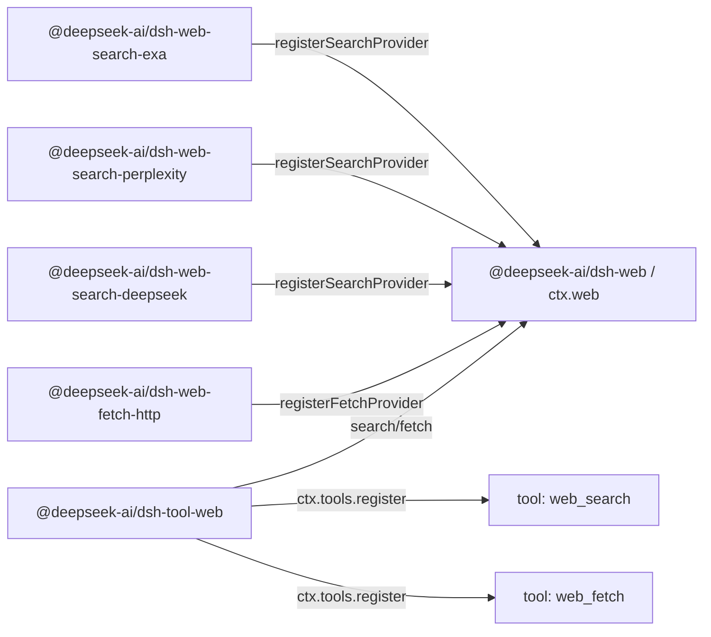

# Agent Note: Web capability seam — công cụ ổn định phủ nhiều provider

Status: implemented

[English](2026-06-24-web-capability-seam.md) | Tiếng Việt

## Vấn đề

harness cần các công cụ web hướng tới model, nhưng không thể ràng buộc convention hướng tới model vào hình dạng API của riêng một vendor. Search là điểm áp lực hiện tại: hỗ trợ đồng thời Exa search và Perplexity search ngay từ đầu — hai hình dạng provider cố ý khác nhau (Exa trả về `results[]` phẳng, mỗi phần tử gồm `{title, url, highlights, publishedDate}`; Perplexity trả về một câu trả lời sinh ra (generative) kèm danh sách trích dẫn) — chính là để chứng minh rằng convention web đã được chuẩn hóa (normalize) không chỉ đơn thuần phản chiếu một vendor. Fetch là một thao tác độc lập khác: backend fetch HTTP(S) công khai, ẩn danh liên quan tới các mối quan tâm về transport, an toàn, redirect, decode và giới hạn kích thước, khác với search được provider hậu thuẫn.

API hướng tới model phải giữ ổn định, trong khi backend có thể thay đổi. Đổi provider search không được làm thay đổi cách model phát khởi một truy vấn; đổi implementation fetch không được làm thay đổi cách model yêu cầu một URL. Ngược lại, package provider cũng không nên tự expose schema công cụ hướng tới model của riêng mình chỉ vì có thêm các knob đặc thù của provider đó.

Nếu đặt search và fetch trực tiếp vào `dsh-tool-web`, công cụ hướng tới model sẽ phải đồng thời gánh việc chọn provider, ánh xạ request tới backend, chiến lược transport, chuẩn hóa kết quả, dẫn dắt prompt, hiển thị và đăng ký schema. Để mỗi provider tự đăng ký công cụ của mình lại gặp vấn đề ngược lại: tính khả dụng, tên, mô tả và tham số của công cụ sẽ phụ thuộc vào việc gói provider nào vừa được load, và các trường đặc thù của provider sẽ rò rỉ vào convention hướng tới model.

Còn có vấn đề chọn provider. `tool-bash` và `tool-fs` hiện tại có thể dựa vào `inject` của Cordis vì chỉ có một service key backend. Web có hai capability độc lập (`search` và `fetch`), mỗi capability có thể có nhiều provider. `inject: ['web']` có thể chứng minh seam tồn tại, nhưng không chứng minh có provider search hoặc fetch khả dụng, cũng không định nghĩa ai thắng khi nhiều provider cùng đăng ký.

## Quyết định

Truy cập web là một capability seam hạng nhất, tuân theo [Agent Note về capability seam](2026-06-13-capability-seams.md):

1. `@deepseek-ai/dsh-web` (`packages/web/web`) sở hữu `ctx.web`, đăng ký provider, chọn provider, từ vựng request/result dùng chung, và các lỗi đặc thù của web.
2. Các package provider triển khai backend cụ thể và đăng ký capability với `ctx.web`, ví dụ `@deepseek-ai/dsh-web-search-exa`, `@deepseek-ai/dsh-web-search-perplexity`, `@deepseek-ai/dsh-web-search-deepseek` và `@deepseek-ai/dsh-web-fetch-http`.
3. `@deepseek-ai/dsh-tool-web` (`packages/web/tool-web`) sở hữu schema công cụ hướng tới model `web_search` và `web_fetch`, đoạn prompt, xác thực tham số, định dạng kết quả, và hiển thị công cụ thông qua `ctx.web`.

Provider không đăng ký công cụ. Provider đăng ký capability. `dsh-tool-web` là chủ sở hữu duy nhất của tên, mô tả, dẫn dắt prompt, JSON Schema và hiển thị hướng tới model.

Search và fetch là hai công cụ độc lập, nhưng thuộc cùng một web-access seam. `ctx.web` sở hữu thống nhất việc chọn provider, từ vựng abort/lỗi và cấu hình triển khai cho hai registry song song. Request schema và logic provider của chúng vẫn tách biệt; service dùng chung là ranh giới sản phẩm để chạm tới web.

`dsh-tool-web` đăng ký công cụ web hướng tới model khi sản phẩm bật công cụ tương ứng và seam `ctx.web` tồn tại. Tính khả dụng của backend là mối quan tâm ở thời điểm thực thi, không phải ở thời điểm đăng ký schema:

- `web_search` được đăng ký khi sản phẩm/ứng dụng bật web search, `web_fetch` được đăng ký khi bật web fetch.
- Công cụ không bao giờ bị hủy đăng ký chỉ vì provider được chọn của nó thiếu, cấu hình sai, thiếu credential, không rõ ràng hoặc tạm thời không khả dụng.
- Provider được resolve tại thời điểm thực thi, trả về `WebError` có cấu trúc khi capability được chọn không thể chạy.

Điều này giữ cho schema model ổn định, không đưa thứ tự load plugin, trạng thái credential hay thời điểm HMR (hot module replacement) vào convention hướng tới model. Nếu web search đã bật nhưng không có provider search nào khả dụng, `web_search` vẫn hiển thị, thất bại tại thời điểm thực thi với `WebError` có cấu trúc (như `WEB_PROVIDER_UNAVAILABLE` hoặc `WEB_PROVIDER_CONFIGURED_UNAVAILABLE`). Nếu một provider xuất hiện sau `dsh-tool-web`, lần thực thi tiếp theo có thể dùng nó ngay mà không cần đổi schema. Nếu một provider biến mất giữa lúc gọi, việc thực thi thất bại với `WebError` có cấu trúc, thay vì âm thầm chọn provider khác hoặc rơi về `UNKNOWN_TOOL`.

Seam này cố ý không phơi bày bất kỳ bề mặt quan sát nào — không có sự kiện thay đổi registry, không có truy vấn trạng thái capability tổng hợp. Tính không khả dụng là một sự kiện mà bên gọi quan sát được thông qua việc thực thi: `search()`/`fetch()` resolve provider tại thời điểm gọi, và ném `WebError` có cấu trúc nêu tên lý do thất bại. [Agent Note về bề mặt quan sát](../../archived/simplification/2026-07-04-drop-unconsumed-web-observation-surface.md) ghi lại phán quyết này: lựa chọn dẫn xuất theo từng lệnh gọi cùng với đăng ký dựa trên việc bật tính năng khiến không có consumer nào cần tín hiệu thay đổi hay dò tính khả dụng độc lập với đường dẫn thực thi và lỗi; một bảng trạng thái provider trong tương lai sẽ tái giới thiệu tập tín hiệu hoặc truy vấn tối thiểu mà nó thực sự tiêu thụ.

## Tô pô package

Sự tách Service Definition / Service Provider / Consumer thành ba package theo cùng mẫu với bash và filesystem, nhưng package *interface* gần với seam LLM (large language model) hơn. `LlmRuntime` (`packages/llm/llm/src/index.ts`) là một registry provider được keyed theo tên: `registerAdapter(models, adapter)` lưu adapter vào `Map`, trả về disposer, ném `DUPLICATE_ADAPTER` khi trùng key, ném `NO_ADAPTER` khi resolve. `ctx.web` theo cùng hình dạng registry đó nhưng có hai lớp capability và chiến lược chọn phong phú hơn (provider id đã cấu hình, hoặc tự động chọn khi lớp đó chỉ có đúng một provider khả dụng đã đăng ký), nên `WebError` ném ra tại thời điểm thực thi có thể giải thích lý do capability search hoặc fetch không chạy được.

Hướng phụ thuộc nhất quán với bash và filesystem:

```text
@deepseek-ai/dsh-tool-web  --depends on-->  @deepseek-ai/dsh-web  <--depends on--  @deepseek-ai/dsh-web-search-exa
        consumer                                 interface                       implementation
                                                                 <--depends on--  @deepseek-ai/dsh-web-search-perplexity
                                                                                  implementation
                                                                 <--depends on--  @deepseek-ai/dsh-web-search-deepseek
                                                                                  implementation
                                                                 <--depends on--  @deepseek-ai/dsh-web-fetch-http
                                                                                  implementation
```

Tại thời điểm chạy, package provider đăng ký capability với `ctx.web`; `tool-web` đăng ký công cụ ổn định với `ctx.tools` và thực thi thông qua seam:



`@deepseek-ai/dsh-web` chỉ phụ thuộc vào Cordis và hạ tầng harness bên dưới. Nó khai báo `ctx.web`, interface provider, kiểu request/result, convention về tính khả dụng của provider và mã lỗi. Nó không import công cụ, agent, session, LLM hay package provider nào.

Package provider chỉ phụ thuộc vào `dsh-web` và Cordis. Chúng sở hữu credential, endpoint, ánh xạ định dạng giao thức, parse và chuyển đổi sang `WebError`, dùng `fetch` của nền tảng. Mỗi provider inject service dùng chung và đăng ký backend; chỉ `dsh-web` sở hữu key `ctx.web`. Hình dạng giao thức riêng của provider không tạo ra phụ thuộc vào `ctx.llm` hay service HTTP của Cordis.

`@deepseek-ai/dsh-tool-web` phụ thuộc vào `@deepseek-ai/dsh-web`, `@deepseek-ai/dsh-tools`, `@deepseek-ai/dsh-system-prompt` và Cordis. Nó không bao giờ import package provider cụ thể.

## Convention `ctx.web`

`ctx.web` là một registry provider cộng với một API thực thi có chọn provider. Phần registry giữ gần với `LlmRuntime`: mỗi lớp capability một `Map<id, provider>`, các phương thức `registerSearchProvider`/`registerFetchProvider` trả về disposer, id trùng ném `WebError`, resolve tại thời điểm thực thi ném exception khi provider được chọn thiếu hoặc không khả dụng. Chữ ký chuẩn xem tại `packages/web/web/src/types.ts`; hình dạng của seam:

```ts
import type { WebFetchRequest, WebFetchResult, WebSearchRequest, WebSearchResult } from '@deepseek-ai/dsh-web'

interface WebSearchProvider {
  readonly id: string
  available(): boolean
  search(request: WebSearchRequest, signal?: AbortSignal): Promise<WebSearchResult>
}

interface WebFetchProvider {
  readonly id: string
  available(): boolean
  fetch(request: WebFetchRequest, signal?: AbortSignal): Promise<WebFetchResult>
}

interface WebRuntime {
  registerSearchProvider(provider: WebSearchProvider): () => void
  registerFetchProvider(provider: WebFetchProvider): () => void

  search(request: WebSearchRequest, signal?: AbortSignal): Promise<WebSearchResult>
  fetch(request: WebFetchRequest, signal?: AbortSignal): Promise<WebFetchResult>
}
```

`signal` tùy chọn là mối quan tâm điều khiển thực thi, không phải input nghiệp vụ: `tool-web` truyền thẳng `exec.signal`, để việc hủy lượt (turn cancellation), timeout công cụ và dispose agent (giải phóng tài nguyên) có thể chạm tới request mạng, stream reader và bước decode tốn kém của provider. Seam không truyền `ToolExecution` — nếu không `dsh-web` sẽ phải phụ thuộc vào `dsh-tools`.

Provider id là chuỗi ổn định, duy nhất trong lớp capability của nó. Đăng ký trùng id provider search hoặc trùng id provider fetch sẽ thất bại, thay vì âm thầm thay thế provider cũ. Đăng ký provider trả về disposer, theo cùng mẫu `ctx.tools.register()`/`ctx.systemPrompt.section()` hiện có: thay đổi được bọc trong `ctx.effect()`, đăng ký bị tháo dỡ cùng với fiber đã đóng góp nó.

## Tính khả dụng và lựa chọn provider

Tính khả dụng của provider và lựa chọn capability là hai khái niệm độc lập, nhưng cả hai đều được giữ tối giản. Provider chỉ báo cáo liệu implementation cụ thể đó có khả dụng hay không, thông qua kiểm tra cục bộ chi phí thấp (như credential có tồn tại, endpoint có cấu hình hợp lệ hay không). `available()` của provider cấm thực hiện network call.

`LlmRuntime` hoàn toàn không có kiểu trạng thái nào: tính khả dụng được biểu đạt qua tư cách thành viên registry cộng với việc ném exception khi resolve. `ctx.web` tuân theo cùng kỷ luật đó. Seam không phơi bày truy vấn trạng thái capability tổng hợp — `search()`/`fetch()` dẫn xuất kết quả chọn tại mỗi lần gọi dựa trên provider id đã cấu hình, các provider đã đăng ký, và giá trị boolean `available()` cục bộ chi phí thấp của từng provider; chọn thất bại chính là `WebError` có cấu trúc được ném ra tại thời điểm thực thi. Bên gọi cần biết một capability có chạy được không sẽ biết thông qua việc thực thi và định tuyến lỗi đó; không có gì được lưu trữ như trạng thái service khả biến.

Giá trị boolean đó là input cho việc chọn, không phải một hệ thống health. `tool-web` không bao giờ gọi trực tiếp `available()` của provider — đường duy nhất nó đi vào seam là `search()`/`fetch()` — nên chiến lược chọn chỉ có một chủ sở hữu.

Việc chọn không được phụ thuộc vào thứ tự đăng ký. Thứ tự load của Cordis, cách sắp xếp cấu hình và thời điểm HMR không phải là ngữ nghĩa sản phẩm.

| Trường hợp | Hành vi thực thi |
|---|---|
| Provider id đã cấu hình đã đăng ký và `available() === true` | Chạy provider đó |
| Provider id đã cấu hình chưa đăng ký | Thất bại với `WEB_PROVIDER_CONFIGURED_MISSING` |
| Provider id đã cấu hình đã đăng ký nhưng không khả dụng | Thất bại với `WEB_PROVIDER_CONFIGURED_UNAVAILABLE` |
| Chưa cấu hình provider id, và lớp đó có đúng một provider đã đăng ký và khả dụng | Chạy provider duy nhất đó |
| Chưa cấu hình provider id, và lớp đó không có provider nào đã đăng ký | Thất bại với `WEB_PROVIDER_UNAVAILABLE` |
| Chưa cấu hình provider id, và lớp đó có nhiều provider khả dụng đã đăng ký | Thất bại với `WEB_PROVIDER_AMBIGUOUS`, thay vì chọn theo thứ tự đăng ký |
| Chưa cấu hình provider id, và có provider tồn tại nhưng đều không khả dụng | Thất bại với `WEB_PROVIDER_UNAVAILABLE` |

Quy tắc "tự động chọn khi chỉ có một provider" hướng tới test, demo và triển khai đơn giản. Cấu hình sản phẩm đặt id provider tường minh:

```yaml
- id: web
  name: '@deepseek-ai/dsh-web'
  config:
    searchProvider: exa
    fetchProvider: http

- id: web-search-exa
  name: '@deepseek-ai/dsh-web-search-exa'

- id: web-search-perplexity
  name: '@deepseek-ai/dsh-web-search-perplexity'

- id: web-search-deepseek
  name: '@deepseek-ai/dsh-web-search-deepseek'

- id: web-fetch-http
  name: '@deepseek-ai/dsh-web-fetch-http'

- id: tool-web
  name: '@deepseek-ai/dsh-tool-web'
```

Ghi đè khi vận hành đi cùng một con đường chọn tường minh: `DSH_WEB_SEARCH_PROVIDER=perplexity` tương đương với cấu hình `searchProvider: perplexity`, chứ không phải chuỗi ưu tiên ngầm bên trong `dsh-tool-web`.

`ctx.web.search()` và `ctx.web.fetch()` resolve provider tại thời điểm thực thi theo quy tắc chọn ở trên. Nếu capability được chọn không khả dụng, chúng ném `WebError` với mã có cấu trúc, như `WEB_PROVIDER_UNAVAILABLE`, `WEB_PROVIDER_CONFIGURED_MISSING`, `WEB_PROVIDER_CONFIGURED_UNAVAILABLE` hoặc `WEB_PROVIDER_AMBIGUOUS`. Nếu không cấu hình provider tường minh và không có provider nào khả dụng, lỗi thực thi là trường hợp `WEB_PROVIDER_UNAVAILABLE` tổng quát; cố ý không cung cấp bản tổng hợp chẩn đoán cho từng provider không khả dụng.

## Schema request và result cho search

Công cụ `web_search` hướng tới model rất nhỏ. Tham số duy nhất hướng tới model là:

- `query`: chuỗi bắt buộc.

`max_results` không được phơi bày cho model. Đây là quyết định ở tầng `dsh-tool-web`: công cụ đặt trần cho số kết quả — cấu hình plugin `searchMaxResults`, mặc định `8` (khớp với mặc định Exa của OpenCode), tương tự `readLimit` của `dsh-tool-fs` — và được truyền như `maxResults` trên `WebSearchRequest` xuống seam. Loại nó khỏi schema model nghĩa là model chỉ cần hỏi, sản phẩm kiểm soát trả về bao nhiêu context; trường này ngày sau có thể được nâng lên thành tham số hướng tới model mà không phá vỡ seam.

`maxResults` chảy theo hướng công cụ → seam → provider, trần được thực thi trên đường trả về:

- `dsh-tool-web` sở hữu giá trị này và đặt nó trên `WebSearchRequest.maxResults`.
- `ctx.web` truyền request nguyên vẹn tới provider được chọn.
- Khi API của provider hỗ trợ kiểm soát số lượng kết quả (`numResults` của Exa), provider áp dụng `maxResults` ở tầng request, như một tối ưu hóa chi phí/độ trễ.
- `ctx.web` thực thi trần trên kết quả: nếu provider trả về số lượng source vượt quá `maxResults` — vì API của nó không có kiểm soát số lượng kết quả (Perplexity) hoặc bỏ qua gợi ý — seam sẽ cắt `sources[]` xuống còn `maxResults` và đặt `WebSearchResult.truncated` thành `true` trước khi trả về. Điều này biến trần thành một đảm bảo duy nhất, xuyên provider mà tầng hướng tới model có thể tin cậy, thay vì thứ mà mỗi provider phải tự nhớ tuân thủ.

Request của seam không mang các điều khiển đặc thù của provider — không có chọn model Perplexity, độ mới của tìm kiếm, bộ lọc domain, `livecrawl` của Exa, `type` của Exa, gợi ý khu vực, ngân sách câu trả lời sinh ra, hay độ sâu tìm kiếm. Chỉ thêm một trường khi nó có ngữ nghĩa độc lập với provider, và cả schema công cụ lẫn provider được chọn đều có thể tuân thủ một cách trung thực.

```ts
interface WebSearchRequest {
  readonly query: string
  /** Upper bound on returned sources; the seam truncates to it. Omitted = no bound. `dsh-tool-web` always sets it. */
  readonly maxResults?: number
}

interface WebSearchResult {
  readonly content?: string
  readonly sources: readonly WebSearchSource[]
  readonly truncated: boolean
}

interface WebSearchSource {
  readonly url: string
  readonly title?: string
  readonly snippet?: string
  readonly publishedAt?: string
}
```

`content` là văn bản câu trả lời do provider sinh ra, ngữ cảnh tìm kiếm hoặc tóm tắt — tùy chọn. `sources[]` là cấu trúc trích dẫn có thể mang tính di động (portable). Source bắt buộc phải có URL; title, snippet và `publishedAt` là tùy chọn vì không phải provider nào cũng trả về chúng. `title` không bắt buộc: trích dẫn kiểu Perplexity có thể chỉ cung cấp URL, ép adapter bịa ra tiêu đề sẽ khiến seam nói dối. `dsh-tool-web` render nhãn dự phòng kiểu `title ?? hostname(url)` để hiển thị. `publishedAt` là dấu thời gian xuất bản/thu thập tùy chọn, dạng chuỗi ISO-8601 — Exa trả về nó dưới dạng `publishedDate` trên mỗi kết quả, Perplexity trả về `date` trên kết quả tìm kiếm, vì vậy đây là dữ liệu thật của provider chứ không phải giá trị dẫn xuất; seam truyền nó dưới dạng chuỗi, việc parse ngày để lại cho consumer.

Exa search ánh xạ mỗi phần tử trong `results[]` phẳng của provider thành một `WebSearchSource`: `url` ← `url`, `title` ← `title`, `snippet` ← mục `highlights[]` đầu tiên (mục không có highlight thì không có snippet mang tính di động, bị loại bỏ), `publishedAt` ← `publishedDate`. Exa không trả về câu trả lời do provider sinh ra, nên `content` được bỏ qua. Perplexity search ánh xạ `choices[0].message.content` thành `content`, và ưu tiên dùng `search_results[]` có cấu trúc ở tầng trên cùng làm `sources[]` — `url` ← `url`, `title` ← `title`, `snippet` ← `snippet` (thường rỗng), `publishedAt` ← `date` — chỉ rơi về mảng `citations[]` chỉ có URL khi `search_results` thiếu (những source này chỉ có `url`). Nếu provider trả về ít trường có cấu trúc hơn những gì seam hỗ trợ, adapter bỏ qua các trường tùy chọn đó.

Việc lấy toàn bộ trang vẫn là trách nhiệm của `web_fetch(url)`. Snippet tìm kiếm là ngữ cảnh khám phá, không phải nội dung trang đã fetch.

## Schema request và result cho Fetch

Implementation của `web_fetch` là một provider fetch HTTP(S) công khai, ẩn danh có id `http`. Nó lấy byte từ URL cụ thể, áp dụng các biện pháp vệ sinh transport cơ bản mô tả dưới đây (chỉ http/https, từ chối credential trong URL, trần byte/thời gian, chặn redirect chéo origin), decode nội dung text, và chỉ trả về kết quả tối thiểu mà model dùng được: URL cuối cùng, mã trạng thái, phần thân và cờ truncated. Nó không mang cookie trình duyệt, credential editor, credential git, token xác thực nội bộ, cũng không ngầm truy cập service riêng tư. (Việc chặn SSRF/mạng riêng tư đầy đủ được hoãn lại — xem [công việc hoãn lại](#deferred-work).)

Request của seam nhỏ hơn công cụ hướng tới model của OpenCode:

- `url`: URL HTTP(S) bắt buộc.

Request của seam cố ý không bao gồm timeout theo từng lệnh gọi, `format`, `prompt` hay các điều khiển trích xuất đặc thù của provider. Việc hủy được thực hiện qua signal thực thi tùy chọn trực tiếp, provider fetch có một trần timeout dự phòng do triển khai cấu hình. `format` là quyết định hiển thị cho tài nguyên đã fetch; `prompt` là chỉ thị tóm tắt LLM ở tầng cao hơn; các API trích xuất như Firecrawl, Exa, Tavily hay Parallel có thể không phơi bày một response HTTP cụ thể. Nếu sản phẩm sau này cần trích xuất trang do provider hậu thuẫn, đó là một capability `web_extract` độc lập hoặc một mở rộng cố ý của seam này — ngữ nghĩa trích xuất không bao giờ được lén đưa vào `web_fetch` bằng cách biến mọi trường HTTP thành tùy chọn.

Mã trạng thái HTTP là một phần của trạng thái tài nguyên đã fetch, không tự động cấu thành thất bại công cụ. Fetch thành công qua mạng nhưng nhận response `404` hoặc `500` sẽ trả về `WebFetchResult` kèm mã trạng thái và phần thân đã decode có giới hạn (khi content type được hỗ trợ). `WebError` dùng cho các thất bại không thể fetch an toàn hoặc không thể biểu diễn tài nguyên: URL không hợp lệ hoặc bị chặn, vi phạm chính sách redirect, timeout, abort, response quá lớn, content type không hỗ trợ, provider thất bại hoặc lỗi mạng.

```ts
export interface WebFetchRequest {
  readonly url: string
}

export interface WebFetchResult {
  readonly url: string
  readonly statusCode: number
  readonly body: WebFetchBody
  readonly truncated: boolean
}

export type WebFetchBody =
  | { readonly kind: 'html'; readonly content: string }
  | { readonly kind: 'text'; readonly content: string }
```

`WebFetchResult.url` là URL cuối cùng sau các redirect được cho phép. URL đã yêu cầu đã nằm trong `WebFetchRequest`, nên không có cặp `requestedUrl`/`finalUrl` riêng.

`WebFetchBody` là discriminated union đóng, vì loại phần thân cần thay đổi phối hợp giữa cả ba: seam, provider và công cụ, chứ không phải một mở rộng plugin độc lập. Switch triệt để (exhaustive) khiến loại mới bị lỗi biên dịch ở mỗi nơi render, cho tới khi được xử lý. Mỗi nhánh object riêng để chỗ cho các trường đặc thù của loại đó.

Provider chịu trách nhiệm fetch tài nguyên an toàn: xác thực URL, transport HTTP, chính sách redirect, timeout, lan truyền abort, trần byte, decode charset, phân loại content type và từ chối nhị phân. `dsh-tool-web` chịu trách nhiệm hiển thị: HTML sang Markdown, HTML sang text thuần, định dạng cắt bớt hướng tới model, và việc tóm tắt trong tương lai.

Các kiểm soát tài nguyên của provider fetch:

- Chỉ chấp nhận URL `http:` và `https:`; từ chối credential trong URL.
- Thực thi độ dài URL tối đa, trần byte response, trần ký tự phần thân đã decode, timeout và số bước nhảy redirect tối đa.
- Signal abort lan truyền tới việc fetch mạng và bước decode tốn kém.
- Chỉ tự động theo redirect cùng origin; redirect chéo origin thất bại với `WEB_REDIRECT_BLOCKED`, yêu cầu một lần gọi công cụ mới, từ đó kích hoạt quyết định provider/quyền mới. (WebFetch của Claude Code dùng cùng mô hình — nó không tự động theo redirect chéo host, mà trả đích redirect về cho model để phát khởi một lệnh gọi mới.)
- Request mang User-Agent sản phẩm tường minh, chứ không âm thầm giả mạo trình duyệt.

Bảo vệ SSRF/mạng riêng tư (chặn đích riêng tư, loopback, link-local, multicast và các đích không công khai khác, phòng vệ rebinding bằng cách resolve DNS trước rồi xác thực IP, và xác thực lại ở mỗi bước redirect) **được hoãn lại** — xem [công việc hoãn lại](#deferred-work). Trước khi nó được triển khai, `web_fetch` là một primitive SSRF, không được bật ở các triển khai có thể chạm tới đích mạng nội bộ nhạy cảm.

## Hành vi công cụ tiêu thụ

`dsh-tool-web` sở hữu hai `ToolDefinition`: `web_search` và `web_fetch`. Nó sở hữu JSON Schema hướng tới model, tên tham số snake_case, đoạn prompt, render kết quả thành `ContentBlock[]`, `presentCall` và `presentResult`.

`dsh-tool-web` bị cấm liệt kê provider hoặc gọi trực tiếp `available()` của provider. Đường duy nhất nó đi vào seam là `ctx.web.search()`/`ctx.web.fetch()`. Điều này giữ việc chọn provider ở đúng một tầng; nếu không, gói công cụ có thể phán đoán một provider khả dụng, trong khi lúc thực thi lại resolve ra trạng thái khác.

Đăng ký công cụ là đồng bộ hóa ổn định, tối giản: khi plugin khởi động, `Config` của `dsh-tool-web` (`search?: boolean`, `fetch?: boolean`, đều mặc định `true`) bật hoặc tắt từng công cụ web; các công cụ đã bật đăng ký qua registry dựa trên effect với disposer có phạm vi fiber; không công cụ nào bị dispose chỉ vì provider được chọn của nó thiếu, không khả dụng hoặc không rõ ràng; dispose fiber `tool-web` sẽ tự động tháo dỡ đăng ký của nó.

Thay đổi tính khả dụng của provider ảnh hưởng tới kết quả thực thi và thông tin chẩn đoán, không ảnh hưởng tới việc schema hướng tới model có tồn tại hay không. Nếu sản phẩm hoàn toàn không cần công cụ web, tắt `dsh-tool-web` hoặc từng công cụ web trong cấu hình; nếu cần công cụ web nhưng backend cấu hình sai, model sẽ thấy lỗi công cụ có cấu trúc tại thời điểm thực thi.

Dẫn dắt prompt giải thích sự phân công ngữ nghĩa — `web_search` dùng để khám phá và lấy thông tin hiện tại, `web_fetch` dùng khi model cần nội dung của một URL cụ thể — prompt và kết quả công cụ nói với model dùng liên kết Markdown để tham chiếu các URL liên quan.

Output hướng tới model ưu tiên văn bản vì kết quả công cụ là `ContentBlock[]`, nhưng sản phẩm của seam vẫn giữ cấu trúc, để UI hiển thị và các adapter tương lai không cần parse văn bản đã render.

## Lỗi

`dsh-web` định nghĩa `WebError extends HarnessError`, với mã lỗi ổn định, chỉ bao phủ những trạng thái mà bên gọi có thể nhánh (branch) một cách hợp lý:

- `WEB_PROVIDER_UNAVAILABLE`
- `WEB_PROVIDER_CONFIGURED_MISSING`
- `WEB_PROVIDER_CONFIGURED_UNAVAILABLE`
- `WEB_PROVIDER_AMBIGUOUS`
- `WEB_DUPLICATE_PROVIDER`
- `WEB_INVALID_URL`
- `WEB_BLOCKED_URL`
- `WEB_REDIRECT_BLOCKED`
- `WEB_FETCH_TOO_LARGE`
- `WEB_FETCH_TIMEOUT`
- `WEB_ABORTED`
- `WEB_UNSUPPORTED_CONTENT_TYPE`
- `WEB_PROVIDER_ERROR`

`WEB_DUPLICATE_PROVIDER` được ném đồng bộ khi `registerSearchProvider`/`registerFetchProvider` phát hiện đã có cùng id trong lớp capability đó (tương tự `DUPLICATE_ADAPTER` của `LlmRuntime`); đây là lỗi lập trình tại thời điểm đăng ký chứ không phải kết quả thực thi, nhưng dùng chung không gian mã `WebError`, để bên gọi thấy một hệ phân loại thống nhất. `WEB_PROVIDER_ERROR` là mã dự phòng cho thất bại của chính provider nổi lên qua seam, bao gồm thất bại mạng/transport trong `web-fetch-http` (DNS, connection refused, TLS); cố ý không đặt mã `WEB_NETWORK` riêng — provider đặt thông điệp mô tả, để model và log có thể phân biệt thất bại mạng với thất bại API provider.

Việc thực thi công cụ để các lỗi này chảy qua `ToolRuntime.execute()`, thứ đã chuyển đổi `HarnessError` thành kết quả công cụ lỗi kèm metadata có cấu trúc. Model nhận được thông điệp lỗi có thể đọc được; hook, test và mã UI có thể định tuyến theo mã lỗi ổn định.

## Kiểm thử

Mỗi tầng được chốt tại ranh giới của chính nó: convention đăng ký/chọn/cắt bớt/abort cùng mã `WebError` trong `dsh-web`; ánh xạ request/response dựa trên fixture đã ghi (dữ liệu test dựng sẵn) cho từng provider (fixture Perplexity gồm trích dẫn chỉ có URL, để giữ các trường source tùy chọn trung thực), cộng với smoke test tự bỏ qua kèm khóa cho từng provider thật; hành vi HTTP cục bộ thật trong `web-fetch-http`; đăng ký được điều khiển bởi việc bật, lỗi thực thi có cấu trúc và định dạng kết quả trong `dsh-tool-web` thông qua registry công cụ thật. Một smoke test Loader thật bảo vệ hai hình dạng export ([postmortem 0001](../../../../docs/postmortem/0001-acp-default-export-drops-inject.md)): `dsh-web` là service dùng export mặc định, còn provider và `tool-web` là plugin namespace, thêm nhầm `export default` sẽ làm mất `inject`.

## Phương án thay thế đã cân nhắc

### Để mỗi provider tự đăng ký công cụ hướng tới model của mình

Điều này nhất quán với hệ thống plugin provider linh hoạt nhất: mỗi provider có thể phơi bày toàn bộ schema gốc của mình. Bị bác bỏ trong harness vì nó trao quyền sở hữu tên hướng tới model, mô tả, dẫn dắt prompt và định dạng kết quả cho package provider. Nhiều provider search sẽ tạo ra tên công cụ trùng lặp hoặc tên công cụ đặc thù provider, model sẽ học chi tiết backend thay vì capability sản phẩm ổn định.

### Đặt việc điều phối provider trực tiếp trong `dsh-tool-web`

Tương tự web search cục bộ của OpenCode: một công cụ `websearch` ổn định điều phối nội bộ tới Exa hoặc Parallel. Có thể chấp nhận cho đường dẫn sản phẩm nhỏ, nhưng sai làm nền tảng harness. Gói công cụ sẽ sở hữu việc chọn provider, credential, ánh xạ request, transport, parse response và hiển thị, khiến việc thêm Exa và Perplexity khó khăn nếu không đưa sự khác biệt của chúng vào schema công cụ.

### Tách search và fetch thành hai seam (`dsh-search`, `dsh-fetch`)

Rất hấp dẫn, vì hai nửa không dùng chung request schema và logic nghiệp vụ, mỗi bên có thể ánh xạ sạch sẽ lên khuôn mẫu ba package của shell/fs, và cặp phương thức `Search`/`Fetch` trùng lặp trên `WebRuntime` cũng sẽ biến mất. Bị bác bỏ vì cơ chế dùng chung — registry id provider, chiến lược chọn không phụ thuộc thứ tự đăng ký, lan truyền abort, hệ phân loại `WebError`, và API cấu hình hướng tới sản phẩm "harness này chạm tới web như thế nào" — là có thật, nếu không sẽ bị lặp lại giữa hai seam gần như giống hệt nhau. Một tầng trung gian `ctx.web` cho sản phẩm một đối tượng inject và cấu hình thống nhất, cho việc chọn provider một chủ sở hữu duy nhất. Cái giá là cặp phương thức `searchX`/`fetchX` song song, điều này được chấp nhận có chủ đích.

### Chọn provider đăng ký đầu tiên

Bị bác bỏ. Thứ tự đăng ký không phải chính sách sản phẩm. Nó có thể thay đổi theo thứ tự cấu hình, việc load plugin, HMR hoặc refactor. Việc chọn provider phải tường minh, hoặc chỉ tự động chọn khi chỉ có đúng một provider khả dụng.

### Coi trích xuất Firecrawl/Exa/Tavily/Parallel là fetch

Bị bác bỏ trong phiên bản đầu tiên. Các provider này thường trả về nội dung đã trích xuất hoặc tóm tắt, không phải một response HTTP cụ thể. Nếu sản phẩm cần trích xuất, thiết kế `web_extract` sau này hoặc mở rộng thao tác fetch một cách cố ý.

### Phản chiếu hình dạng `url + prompt` của WebFetch từ Claude Code

Bị bác bỏ ở tầng seam. `prompt` biến fetch thành tóm tắt LLM và ràng buộc việc lấy web công khai vào provider model. Seam của harness nên fetch và decode một cách tất định; `dsh-tool-web` sau này có thể cung cấp tóm tắt như một chế độ hiển thị mà không cần `ctx.web` phụ thuộc vào `ctx.llm`.

## Hậu quả

**Schema search cố ý tinh gọn.** Cả Exa và Perplexity đều phơi bày các điều khiển đặc thù provider hữu ích; chỉ thêm một điều khiển khi nó có thể định nghĩa theo cách độc lập với provider, và cả đăng ký công cụ lẫn thực thi provider đều có thể tuân thủ trung thực.

**Trích dẫn Perplexity có thể thưa thớt.** Một trích dẫn có thể chỉ có URL. Đặt `title` và `snippet` là tùy chọn giữ seam trung thực, nhưng nghĩa là `tool-web` cần render nhãn dự phòng.

**Đăng ký công cụ ổn định đẩy lỗi cấu hình sang thời điểm thực thi.** Khi sản phẩm bật truy cập web, giữ công cụ hiển thị là đúng đắn; nhưng ứng dụng sản phẩm kỳ vọng web search khả dụng nên phơi bày rõ ràng các thất bại có cấu trúc `WEB_PROVIDER_CONFIGURED_MISSING`/`WEB_PROVIDER_CONFIGURED_UNAVAILABLE`/`WEB_PROVIDER_AMBIGUOUS`, tránh để người dùng không phát hiện ra vấn đề cấu hình cho tới khi model gọi công cụ.

**Trạng thái provider có thể thay đổi sau khi khởi động.** Một công cụ có thể hiển thị trong request được lắp ráp lúc bắt đầu bước, nhưng mất provider của nó trước khi thực thi. Đường thực thi resolve lại và thất bại với lỗi có cấu trúc.

**Fetch là ranh giới mạng, không chỉ là công cụ chỉ đọc.** `web_fetch` có thể chạm tới đích mạng nhạy cảm hoặc rò rỉ dữ liệu qua URL. Chỉ giao các biện pháp vệ sinh transport cơ bản (chỉ http/https, từ chối credential, trần byte/thời gian, chặn redirect chéo origin); việc chặn SSRF/mạng riêng tư được hoãn lại (xem [công việc hoãn lại](#deferred-work)), nên trước khi nó được triển khai, `web_fetch` không được bật ở môi trường có thể chạm tới đích nội bộ.

**Lượng lớn nội dung web có thể làm hại chất lượng context.** Provider thực thi trần byte/ký tự và báo cáo `truncated`; `tool-web` định dạng output model có giới hạn, kèm dẫn dắt tiếp tục hoặc theo dõi rõ ràng.

<a id="deferred-work"></a>

## Công việc hoãn lại

- Bảo vệ SSRF/mạng riêng tư cho `web_fetch`: chặn đích riêng tư, loopback, link-local, multicast và các đích không công khai khác, để `web_fetch` không còn là primitive SSRF. Triển khai đúng đắn không chỉ là kiểm tra chuỗi URL — cần resolve DNS trước rồi kết nối tới IP đã xác thực (phòng vệ DNS rebinding/TOCTOU), xác thực lại ở mỗi bước redirect, và xử lý biên IPv6 (dải riêng tư, địa chỉ ánh xạ IPv4). Các implementation tham chiếu đã khảo sát đều không chặn ở mức IP (OpenCode kiểm tra tiền tố rồi fetch trực tiếp; Claude Code dựa vào danh sách đen hostname tập trung cộng với gợi ý prompt "URL riêng tư sẽ thất bại"), nên không có implementation nào để sao chép, và đây là tuyến phòng thủ SSRF duy nhất của harness — đáng để có một thiết kế/spike riêng. Trước khi nó được triển khai, `web_fetch` chỉ nên được bật ở các triển khai không thể chạm tới đích nội bộ nhạy cảm.
- Loại `WebFetchBody` `pdf`: provider `http` decode PDF có thể trích xuất văn bản (cố gắng hết sức, có giới hạn, `truncated`) thành nhánh `{ kind: 'pdf'; content; pageCount? }`, `tool-web` render nó. Đây là fetch chứ không phải `web_extract` — việc lấy PDF là một HTTP 200 cụ thể cộng với decode cục bộ tất định, không phải trích xuất phía provider cho tài nguyên phi HTTP. Thêm nó là một thay đổi phối hợp qua `dsh-web` (khai báo nhánh), provider (decode + thu hẹp "từ chối nhị phân" thành "từ chối nhị phân, trừ PDF có thể trích xuất văn bản"; PDF quét/hình ảnh cần OCR nằm ngoài phạm vi) và `tool-web` (render). Union `WebFetchBody` đóng khiến consumer lỗi biên dịch cho tới khi nhánh mới được xử lý.
- Trích xuất do provider hậu thuẫn như một capability `web_extract` độc lập, thay vì âm thầm mở rộng `web_fetch`.
- Tích hợp chính sách quyền: hệ thống quyền hiện đã tồn tại ([sandbox và phê duyệt](../feature/2026-07-06-sandbox.md), [preset quyền web](../feature/2026-07-23-web-permission-and-approval.md)), nhưng chỉ đóng gói chế độ sandbox và chính sách phê duyệt; chính sách quyền web vẫn chưa được tích hợp.
- Các điều khiển search độc lập với provider ngoài `query` và `maxResults`, sẽ thêm khi cả Exa và Perplexity đều có thể tuân thủ trung thực.

## Câu hỏi mở

- Có nên để package ứng dụng sản phẩm dò cấu hình web lúc khởi động (coi `WEB_PROVIDER_CONFIGURED_MISSING`, `WEB_PROVIDER_CONFIGURED_UNAVAILABLE` và `WEB_PROVIDER_AMBIGUOUS` là lỗi nghiêm trọng khi web được cấu hình tường minh) hay để lỗi cấu hình nổi lên vào lần thực thi đầu tiên?
- Trong hệ thống quyền đã giao ([sandbox và phê duyệt](../feature/2026-07-06-sandbox.md), [preset quyền web](../feature/2026-07-23-web-permission-and-approval.md)), chính sách quyền cho truy cập web công khai nên đặt ở đâu: một plugin quyền web chuyên biệt trên `tools/execute`, cấu hình provider, hay cả hai?
</content>
