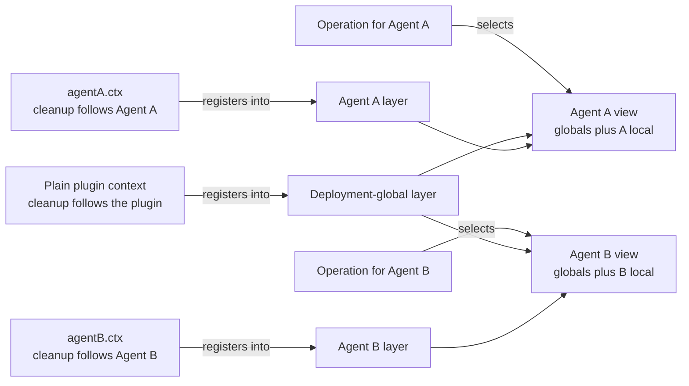
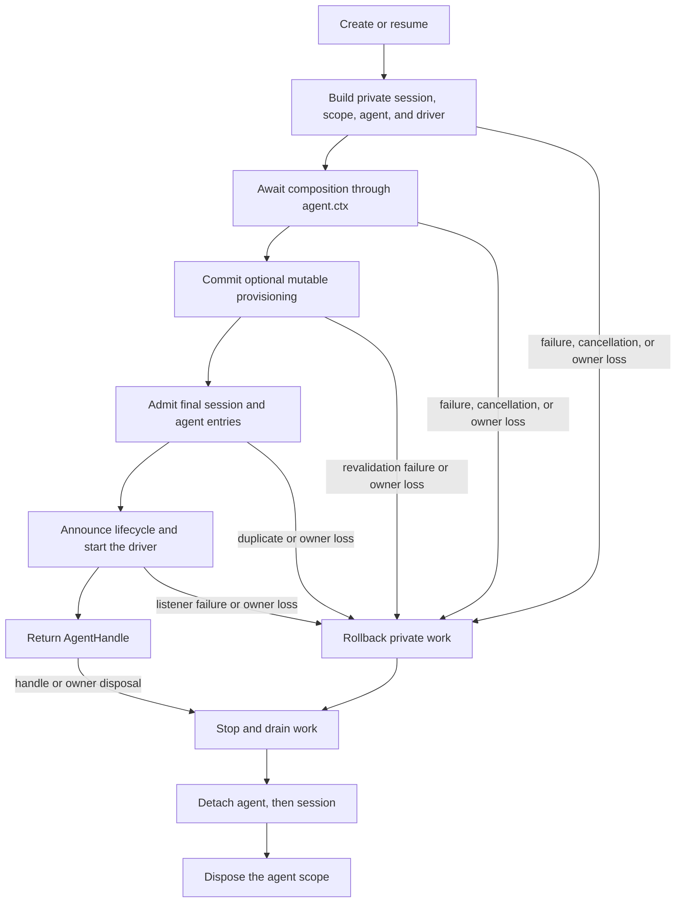

# Agent Note: agent chính là scope đăng ký

Status: implemented

[English](2026-07-08-agent-scope-contexts.md) | Tiếng Việt

## Vấn đề

Một ứng dụng cần chia sẻ hạ tầng giữa nhiều agent (smart agent), trong khi mỗi agent lại sở hữu tool, đóng góp prompt, chính sách và listener riêng của mình. Adapter, việc lưu trữ bền vững và giao diện người dùng dùng chung thuộc về tầng deployment; còn persona, biến thể tool hay listener thường chỉ thuộc về một agent duy nhất.

Xây dựng một service graph độc lập cho mỗi agent sẽ lặp lại hạ tầng dùng chung. Dùng một registry graph toàn cục lại gặp vấn đề ngược lại: đóng góp đặc thù của một agent có thể rò rỉ sang các agent không liên quan. Phía đóng góp cần một cơ chế đăng ký thông thường, vừa quyết định ai có thể thấy một đóng góp, vừa quyết định khi nào nó được dọn dẹp.

Cơ chế này còn cần một ranh giới phát hành (publish). Agent không được trở nên hiển thị trước khi thế giới cục bộ của nó được xây dựng xong, và khi tháo dỡ cũng phải giữ thế giới cục bộ đó cho tới khi công việc cuối cùng dừng hẳn.

## Quyết định

Mỗi agent đang sống sở hữu một lớp đăng ký phẳng, được phơi bày qua `agent.ctx`. Code đăng ký thông qua context sở hữu đóng góp đó; các dịch vụ nhận biết scope sẽ hợp nhất đăng ký toàn cục ở cấp deployment với đúng một lớp agent khớp; thao tác chọn lớp đó từ agent thật sự của nó; lớp này tồn tại suốt vòng đời phát hành đầy đủ của agent.

Cordis là framework plugin nền tảng của SDK. **Context** trong Cordis là đối tượng plugin dùng để truy cập dịch vụ và đăng ký effect, việc dọn dẹp effect đi theo context đó. [Nhập môn Cordis](../../../../docs/cordis-primer.md) giải thích chi tiết hơn về framework này.

Với phần lớn phía đóng góp, quy ước đầy đủ gồm bốn quy tắc:

| Câu hỏi | Quy tắc |
|---|---|
| Đăng ký hành vi cho một agent ở đâu? | Gọi API đăng ký thông thường qua `agent.ctx` |
| Thao tác của một agent thấy được gì? | Toàn cục cấp deployment cộng lớp của agent đó, theo quy tắc hợp nhất của dịch vụ sở hữu |
| Những listener theo scope nào sẽ chạy? | Listener không theo scope cộng listener đã đăng ký cho agent sở hữu thao tác đó |
| Lớp đó tồn tại bao lâu? | setup hoàn tất trước khi phát hành; dispose (giải phóng tài nguyên) giữ lớp đó cho tới khi công việc dừng hẳn |

Scope là phẳng. Việc resolve không bao giờ đi qua scope cha hay scope anh em, quyền sở hữu vòng đời cũng không hàm ý kế thừa đăng ký.



Cạnh giao nhau bị thiếu chính là quy tắc cô lập: đăng ký cục bộ của Agent A sẽ không đi vào view của Agent B, đăng ký của cha cũng không đi vào view của con chỉ vì cha sở hữu vòng đời của con.

[Agent Note về thiết kế runtime](2026-07-12-agent-scope-runtime-design.md) đi kèm trình bày về implementation và lập luận về tính đúng đắn. [Agent Note về kiểm soát tổ hợp subagent](../feature/2026-07-12-subagent-persona-tool-filter-and-depth.md) chịu trách nhiệm riêng cho các tính năng độc lập `persona`, `toolFilter` và `maxDepth`.

### Nguồn đăng ký quyết định khả năng hiển thị và việc dọn dẹp

Đăng ký thông qua context plugin thông thường mang tính toàn cục cấp deployment, được dispose cùng plugin đó. Cùng một phương thức được gọi qua `agent.ctx` thì lại đóng góp cho một agent, được dispose cùng scope của agent đó.

| Nguồn đăng ký | Khả năng hiển thị mặc định | Dispose theo ai |
|---|---|---|
| Context plugin thông thường | Mỗi view agent đủ điều kiện | Plugin đăng ký |
| `agent.ctx` | Chỉ view của agent đó | Scope của agent |

Tool, đoạn prompt và biến, giới hạn tool, guard và listener event theo scope đều tuân theo quy ước này. Giá trị cục bộ có tên thường che (shadow) giá trị toàn cục cùng tên đối với agent đó; tài liệu của từng dịch vụ sở hữu sẽ nêu ngoại lệ và hành vi hợp nhất.

Mẫu hình cho phía đóng góp thông thường là đăng ký toàn bộ thế giới cục bộ trong quá trình setup agent:

```js
const handle = await ctx.agents.create({
  sessionId: SessionId('reviewer'),
  agentOptions: { model: 'model-name' },
  setup(agentCtx) {
    agentCtx.systemPrompt.section({
      name: 'deployment:persona',
      order: 0,
      text: 'Review code, but do not modify files.',
    })
    agentCtx.tools.register({
      name: 'review_summary',
      description: 'Return the review summary.',
      parameters: { type: 'object', properties: {} },
      async execute() {
        return [{ type: 'text', text: 'review complete' }]
      },
    })
  },
})

ctx.tools.get('review_summary')                // undefined: not global
ctx.tools.get('review_summary', handle.agent)  // the reviewer-local tool

await handle.dispose()
ctx.tools.get('review_summary', handle.agent)  // undefined: scope is gone
```

setup nhận một context Cordis đáng tin cậy đầy đủ, do đó có thể tổ hợp cả plugin thông thường lẫn dịch vụ. Quy ước của nó chỉ giới hạn ở việc tổ hợp: không hỗ trợ việc điều khiển hay phát hành một agent đang được xây dựng dở bằng cách ép kiểu (cast) hay gọi registry nội bộ.

### Thao tác chọn view

Nguồn đăng ký và chủ thể thao tác là hai fact độc lập. Việc gọi dịch vụ qua `agent.ctx` quyết định đăng ký mới thuộc về đâu, chứ không ràng buộc các lần đọc sau này với agent đó.

Việc tra cứu và thực thi tool nhận đúng agent mà nó phục vụ. Việc lắp ráp prompt nhận context lắp ráp của agent đang xây dựng request. Việc phân phối event nhận đúng chủ thể thuộc lĩnh vực của nó. Điều này cho phép tái sử dụng cùng một instance dịch vụ giữa nhiều agent, trong khi vẫn giữ view của mỗi thao tác tường minh.

Chỉ những dịch vụ đã áp dụng quy ước scope mới resolve lớp agent. `agent.ctx` không tự động thay đổi hành vi của một lời gọi dịch vụ Cordis tùy ý.

### Event theo scope tách biệt routing khỏi dữ liệu event

Một event liên quan tới Agent A thường tới cả listener không theo scope lẫn listener theo scope A, nhưng không tới listener theo scope B. Event không có chủ thể agent chỉ tới listener không theo scope.

Ở tầng Cordis, `Scoped<T>` là một bộ nhận (receiver) routing mờ (opaque). Nó mang theo filter dùng để chọn listener, nhưng bản thân nó không phải đối tượng lĩnh vực. Do đó chữ ký event vẫn giữ `Agent` thật, việc thực thi tool, yêu cầu approval, hay chủ thể khác làm tham số tường minh để listener kiểm tra.

Listener đăng ký với `{ global: true }` cố ý bỏ qua bộ lọc đối tượng theo context, nhưng việc dọn dẹp của nó vẫn theo context đăng ký. Thông báo thay đổi thành viên registry giữ nguyên không lọc, vì chúng mô tả trạng thái registry dùng chung chứ không phải thao tác của một agent. Tài liệu tham chiếu event đầy đủ là tập hợp các khối `cordis-surface` được sinh trên [các trang subsystem](../../../../docs/subsystems/core.md) — mỗi scope event nằm trên trang sở hữu của nó (`agent/*` và `agent-loop/*` ở trang core.md này).

### Tạo phát hành sau cùng, dispose thu hồi sau cùng

`ctx.agents.create()` và `resume()` xây dựng session, scope, agent và driver chưa được phát hành. Chúng chờ `setup`, gọi đồng bộ `AgentSetupCommit` tùy chọn của nó, chấp nhận (admit) bản ghi session và agent cuối cùng, công bố theo thứ tự, khởi động loop, rồi mới trả về handle. Thao tác commit này cho phép trạng thái cấu hình có thể thay đổi được xác thực lại tại đúng ranh giới phát hành, sau khi mọi await của setup đã kết thúc; nếu nó ném exception, hệ thống sẽ rollback transaction riêng tư trước khi công bố bất kỳ identity nào, còn việc thu hồi sau khi commit thành công thuộc về việc tháo dỡ vòng đời sống thông thường.

Signal tạo tùy chọn chỉ hủy công việc trong lúc tạo hoặc resume đang treo (pending). Sau khi promise resolve, `AgentHandle` được trả về sở hữu quyền dispose tường minh.

Nếu việc load, setup, commit setup tùy chọn, chấp nhận hoặc phát hành thất bại, transaction riêng tư sẽ rollback mọi thứ nó đã chuẩn bị. Các thao tác đồng thời dùng cùng một ID sống do phía gọi cung cấp có thể đều tới được bước setup, nhưng chỉ đúng một bản ghi registry cuối cùng được chấp nhận; mỗi bên thua sẽ bị từ chối và dọn dẹp tài nguyên riêng tư của nó. Việc tái sử dụng tuần tự sau khi chờ dispose hoàn tất vẫn hoạt động bình thường.

`AgentHandle.dispose()` đảo ngược ranh giới này. Nó vô hiệu hóa việc tạo hoặc driver, chờ việc phát hành đồng bộ hoàn tất unwind, dừng và rút cạn driver cùng việc flush session cuối cùng, tách agent khỏi session, rồi mới dispose scope. Các yêu cầu dispose lặp lại hoặc cạnh tranh nhau sẽ được gộp thành một promise hoàn tất duy nhất.

Context Cordis của phía gọi và factory AgentLoop cụ thể là đồng sở hữu về mặt cấu trúc. Việc unload bên nào cũng sẽ dispose transaction hoặc agent đang sống.



## Bảo mật và quyền hạn nằm ngoài mục tiêu

Việc tổ hợp agent scope tổ hợp các đăng ký đáng tin cậy cùng một tiến trình. Nó không sandbox plugin, không định nghĩa lattice quyền hạn từ cha xuống con, không đóng băng authorization lúc tạo, cũng không bảo đảm con không thể làm những việc vượt quá cha.

Cha có thể sở hữu một con có tool hiển thị rộng hơn chính nó, vì quyền sở hữu vòng đời không trao cũng không giới hạn đăng ký. Plugin nắm giữ context Cordis cũng chạy trong cùng tiến trình, có thể gọi trực tiếp bất kỳ dịch vụ khả dụng nào.

Các deployment cần bảo đảm không tự leo thang quyền (non-escalation) cần một biểu diễn quyền hạn độc lập, quy tắc lan truyền, và kiểm tra thực thi riêng. Việc ủy quyền tập con của cha, snapshot quyền tại thời điểm tạo, API ủy quyền tương lai tường minh, cùng các nhãn năng lực/output/termination phổ quát đều nằm ngoài phạm vi quyết định này.

## Các phương án thay thế từng cân nhắc

Các thiết kế bị bác bỏ hoặc tách khả năng hiển thị khỏi việc dọn dẹp, hoặc chỉ bao phủ một loại đăng ký, hoặc lặp lại hạ tầng dùng chung, hoặc lẫn lộn quyền sở hữu vòng đời với kế thừa.

### Truyền option agent cho mỗi lần đăng ký

Một API dạng `tools.register(definition, { agent })` sẽ lặp lại logic truyền scope trong mỗi registry, và cho phép quyền sở hữu khả năng hiển thị lệch khỏi quyền sở hữu dọn dẹp. Việc đăng ký qua `agent.ctx` khiến cả hai fact đi theo cùng một chủ sở hữu effect Cordis.

### Lọc event nhưng giữ registry toàn cục

Việc lọc listener có thể ngăn hook sai chạy, nhưng không thể giới hạn scope cho tool schema, tra cứu executable, đoạn prompt, biến, hay dữ liệu đã đăng ký khác. Việc tổ hợp cục bộ theo agent vẫn cần thay đổi toàn cục tạm thời.

### Tạo service graph độc lập cho mỗi agent

View cần thiết là dịch vụ deployment dùng chung cộng một lớp đăng ký cục bộ. Mỗi agent một service graph sẽ lặp lại adapter, và làm phức tạp việc lưu trữ bền vững, registry provider và khởi động ứng dụng dùng chung.

### Kế thừa scope đăng ký của cha

Quan hệ cha-con mô tả vòng đời và phả hệ hội thoại, chứ không phải chiến lược hợp nhất chung. Việc tra cứu theo cấp bậc sẽ khiến dịch vụ không liên quan bị kế thừa ngoài ý muốn, và không thể định nghĩa được tính bảo mật nếu thiếu một mô hình quyền hạn độc lập.

## Hệ quả

Phía đóng góp dùng một mẫu hình quen thuộc: đăng ký hành vi dùng chung qua context plugin, đăng ký hành vi cục bộ qua `agent.ctx`, chọn agent thật trong thao tác, dispose handle được trả về. Từ góc nhìn observer, setup cùng commit phát hành tùy chọn của nó có tính nguyên tử (atomic), còn việc tháo dỡ giữ hành vi cục bộ cho tới khi công việc dừng hẳn.

Cái giá phải trả là việc chọn chủ thể tường minh, việc tạo lập trình bất đồng bộ, và dịch vụ cần áp dụng scope từng cái một. Scope đăng ký phẳng cố ý không đồng nghĩa với quyền hạn, việc kiểm soát tổ hợp subagent tồn tại như một tính năng độc lập, chứ không phải ngữ nghĩa scope ẩn.
