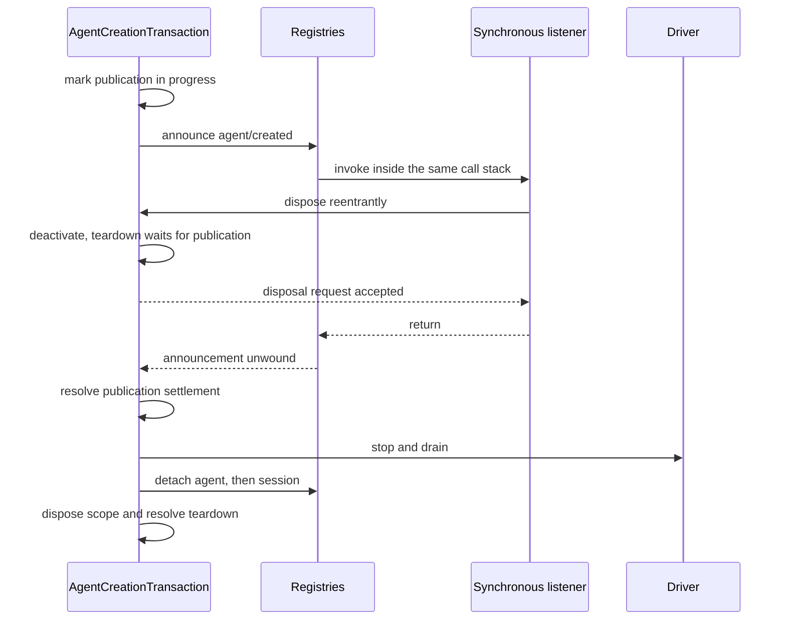

# Agent Note: Thiết kế runtime và tính đúng đắn của phạm vi Agent

Status: implemented

[English](2026-07-12-agent-scope-runtime-design.md) | Tiếng Việt

## Vấn đề

[Quy ước phạm vi agent (tác tử)](2026-07-08-agent-scope-contexts.md) rất đơn giản với người đóng góp: đăng ký qua `agent.ctx`, phân giải ra một góc nhìn gồm phần toàn cục cộng một agent, chỉ công bố sau khi setup hoàn tất, và giữ phạm vi cho tới khi công việc dừng lại. Runtime phải duy trì quy ước này trong các tình huống như framework plugin kiểu cộng tác, tạo lập bất đồng bộ, listener có thể tái nhập, commit phiên có lưu bền, cũng như sự cố worker hoặc tiến trình.

Rủi ro thiết kế chính là đưa ra bộ cơ chế thứ hai cho mỗi điều kiện tranh chấp. Các cơ chế đặt chỗ riêng, cờ sẵn sàng, bộ tiếp sức hủy, tầng snapshot và registry bảo vệ có thể cùng phản chiếu một sự thật, cho đến khi không người đọc nào phân biệt được cái nào mới có thẩm quyền. Những cơ chế đó còn dụ runtime đối xử với một lời gọi có kiểu đáng tin như thể là một ranh giới tuần tự hóa thù địch.

Phần hiện thực cần đủ trạng thái để duy trì quyền sở hữu thật và ranh giới kết toán, nhưng không nhiều hơn thế. Người rà soát tính đúng đắn phải có thể lần theo một chuỗi sự thật duy nhất từ lúc tiếp nhận, công bố cho tới tháo dỡ, mà không cần đối chiếu giữa những biểu diễn song song.

## Quyết định

Runtime dùng một cơ chế cho mỗi sự thật độc lập. Định tuyến phạm vi có một vật mang không minh bạch và một layer store dùng chung; mỗi đối tượng registry đang hoạt động có một mục registry; mỗi thao tác tạo lập hay khôi phục có một giao dịch; lời gọi có kiểu trong cùng tiến trình mượn các giá trị readonly; ranh giới dữ liệu thật chỉ hiện thực hóa một lần; kết quả của quá trình lắp ráp lời nhắc kiểu cộng tác chính là thẩm quyền; mã worker/tiến trình chỉ giữ riêng trạng thái kết thúc và trạng thái dừng hẳn khi các bên sở hữu khác nhau thực sự có thể tranh chấp.

Thiết kế này có thể tóm lại thành bảy lựa chọn:

| Vấn đề | Cơ chế có thẩm quyền |
|---|---|
| Chọn đăng ký toàn cục cộng một agent nào đó | Khóa phạm vi không minh bạch, vật mang định tuyến và layer store dùng chung |
| Sở hữu một agent hoặc phiên đang hoạt động | Một mục registry duy nhất được disposer của nó nắm giữ |
| Điều phối tạo lập/khôi phục | Một `AgentCreationTransaction` duy nhất |
| Bảo vệ dữ liệu lưu bền, hàng đợi, mô hình hoặc định dạng giao thức | Hiện thực hóa một lần tại ranh giới đó |
| Truyền giá trị có kiểu trong cùng tiến trình | Quy ước mượn readonly |
| Tổ hợp lời nhắc và tập công cụ mà mô hình nhìn thấy | Một góc nhìn công cụ dùng chung cộng kết quả assembly-waterfall (sự kiện kiểu thác nước) có thẩm quyền |
| Điều phối việc đóng subagent, worker và tiến trình | Một tín hiệu hủy duy nhất cộng sự thật trạng thái kết thúc/dừng hẳn riêng cho ranh giới đó |

Phần còn lại của Agent Note này triển khai các lựa chọn trên theo thứ tự phụ thuộc: cơ chế Cordis, định tuyến phạm vi, tạo lập và commit phiên, công cụ và lời nhắc, subagent và workflow, cuối cùng là các kiểm tra thực thi được.

[Agent Note ngày 8 tháng 7](2026-07-08-agent-scope-contexts.md) vẫn là quy ước cho người đóng góp. [Agent Note về điều khiển tổ hợp subagent](../feature/2026-07-12-subagent-persona-tool-filter-and-depth.md) độc lập sở hữu `persona`, `toolFilter` và `maxDepth`; bài này chỉ bàn cách setup của chúng hòa vào vòng đời.

## Mô hình Cordis: context, fiber, effect, receiver và waterfall

Để hiểu phần hiện thực cần nắm năm khái niệm Cordis. Context chọn dịch vụ và quyền sở hữu đăng ký; fiber là một plugin hoặc vòng đời con đang hoạt động; effect gắn logic dọn dẹp vào fiber; bộ nhận sự kiện chọn listener; waterfall để listener lần lượt biến đổi hoặc cắt ngắn một thao tác.

### Context là đường sở hữu xuyên suốt một đồ thị dịch vụ duy nhất

Mọi agent dùng chung một đồ thị dịch vụ Cordis. Context dẫn xuất không nhân bản `ToolRuntime`, `SystemPrompt`, lớp lưu bền hay adapter mô hình; cái nó thay đổi là: đăng ký thực hiện qua context đó được đánh dấu ra sao, và effect nào sở hữu logic dọn dẹp của chúng.

`agent.ctx` chính là một context dẫn xuất như vậy. Lời gọi dịch vụ vẫn đến đúng thực thể dùng chung, còn thao tác đăng ký có thể kiểm tra context gọi nó và lưu đóng góp dưới khóa phạm vi gần nhất. Context plugin thông thường không mang khóa phạm vi, nên đăng ký vào phạm vi toàn cục.

### Fiber và effect khiến việc dọn dẹp mang tính cấu trúc

Fiber Cordis là thực thể hoạt động được tạo ra khi một plugin hoặc context con được kích hoạt. Trạng thái của nó ghi lại vòng đời đó đang là active, unloading, failed hay disposed. `ctx.effect()` và `ctx.on()` trả về disposer, đồng thời gắn các disposer ấy vào fiber nơi thực hiện đăng ký, nên gỡ tải một plugin hoặc một phạm vi agent sẽ loại bỏ mọi thứ đã đăng ký qua context đó mà không cần một bản kê riêng.

Phần hiện thực fiber Cordis trong vendor thiết lập quyền sở hữu trước khi bất kỳ setup hoặc observer `internal/plugin` nào chạy. Việc gỡ tải có thể tái nhập nhìn thấy được các fiber con hoặc effect đã khởi động, từ chối những effect được thêm sau khi quá trình gỡ tải bắt đầu, và tham gia vào quá trình dọn dẹp đã khởi động qua một disposer một-lần được công khai. Các observer tháo dỡ được cách ly riêng lẻ, nên một callback không thể chặn việc dọn dẹp mang tính cấu trúc.

Đây là các bảo đảm vòng đời của framework, không phải chính sách riêng của agent. Việc tạo agent dựa vào chúng, vì setup có thể kích hoạt plugin bất kỳ và tái nhập đồng bộ vào dispose (giải phóng tài nguyên) của bên sở hữu.

### Receiver định tuyến listener; waterfall tổ hợp quyết định

Cordis dùng dispatch receiver (`this`) để lọc listener, còn listener của harness cần một chủ thể tường minh là agent, execution, request hoặc chủ thể khác. `Scoped<T>` đánh dấu receiver mà một khai báo sự kiện có phạm vi mong đợi, nhưng vật mang runtime cố ý không phơi bày API của chủ thể.

Do đó, các hàm trợ giúp phía sản phẩm dựng vật mang và truyền chủ thể lĩnh vực một cách riêng biệt. Điều này ngăn việc định tuyến listener trở thành một mô hình đối tượng thứ hai, và giúp chữ ký sự kiện vẫn dễ hiểu ngay cả khi không biết nội tình của vật mang.

Waterfall của Cordis là dispatch kiểu middleware. Mỗi listener nhận `next()`: gọi nó thì ủy quyền cho các listener còn lại và thao tác cơ sở, không gọi thì cắt ngắn hoặc thay thế kết quả phía dưới. Waterfall điều khiển việc lắp ráp lời nhắc và chính sách công cụ; sự kiện emit thường thông báo đồng bộ, còn sự kiện parallel chờ tất cả listener nhưng không có kết quả phủ quyết.

## Định tuyến phạm vi: một khóa không minh bạch chọn một layer

Gói scope hiện thực đối tượng tối thiểu mà việc định tuyến Cordis cần. Vật mang của nó chỉ giữ một bộ lọc dịch vụ tổ hợp cùng một vị từ phạm vi, còn khóa không minh bạch được ghi ở mức riêng tư trong gói, và disposer — thứ sẽ chờ fiber phạm vi dừng hẳn — được phơi bày riêng.

### Định danh phạm vi dùng định danh đối tượng

`ScopeKey` là một đối tượng không minh bạch được so sánh theo định danh. Harness dùng chính `Agent` đang hoạt động làm khóa cho nó, nhưng nguyên thủy này độc lập với lĩnh vực và hỗ trợ những bên sở hữu phạm vi khác.

`createScope(parent, key)` trả về một phạm vi có `ctx` dùng chung dịch vụ của cha, và effect của nó được đánh dấu bằng khóa đó. `scopeOf(ctx)` đọc khóa đăng ký gần nhất. `scopeTarget(base, key)` tạo bộ nhận sự kiện có bộ lọc giữ lại bộ lọc dịch vụ Cordis của base receiver, sau đó chấp nhận listener không phạm vi và listener mang đúng khóa đó.

Receiver là một vật mang nhỏ chứ không phải proxy trong suốt của đối tượng lĩnh vực. Mã cần agent thì nhận tham số sự kiện tường minh; mã cần quyền sở hữu đăng ký thì nhận `agent.ctx`.

### Đọc registry chồng lên đúng một layer

Registry có nhận thức phạm vi dùng `ScopedLayers`, sở hữu một aggregate toàn cục được tạo ngay lập tức và các aggregate được tạo lười theo khóa định danh. Việc đọc phân giải layer toàn cục và nhiều nhất một layer cục bộ chính xác; nó không tạo trạng thái và không bao giờ duyệt chuỗi cha. Khả năng nhìn thấy đăng ký và quyền sở hữu effect của Cordis đều dẫn xuất từ cùng một context, còn việc thu hồi sẽ chờ toàn bộ aggregate của layer cụ thể trở nên rỗng (xem [quyết định](2026-07-12-scoped-layers-store.md)).

Mỗi dịch vụ giữ nguyên quy tắc lĩnh vực của mình. Command có tên và góc nhìn lời nhắc dùng cơ chế trộn che khuất dùng chung, giữ thứ tự chèn; công cụ giữ một resolver phong phú hơn, vì các hạn chế sẽ lọc công cụ toàn cục trước khi thêm công cụ cục bộ, còn transport Code Mode được giữ chỗ thì chèn riêng. Biến lời nhắc và guard công cụ giữ kiểu duyệt trực tiếp, còn quan hệ thành viên của bên cung cấp công cụ được hiện thực hóa theo từng lần lắp ráp. Scope cung cấp vòng đời lưu trữ và cơ chế che khuất theo tên, chứ không phải một góc nhìn registry đa dụng.

### Hàm trợ giúp dispatch hợp nhất ngăn chủ thể bị trôi lệch

`agentEvents(context, agent)` dựng vật mang của agent và tiêm chính agent đó làm chủ thể sự kiện. Các dịch vụ phiên, công cụ, phê duyệt, lời nhắc và subagent cũng dẫn xuất định tuyến từ đối tượng mà chúng đã sở hữu, thay vì nhận một khóa không liên quan.

Dấu kiểu từ chối việc dùng sai receiver trần thông thường, còn bất biến ở môi trường phát triển bao phủ dispatch qua JavaScript trực tiếp hoặc qua ép kiểu. Chủ thể vẫn tường minh, vì tính đúng đắn của định tuyến và dữ liệu sự kiện hữu ích là hai mối quan tâm khác nhau.

## Tạo lập Agent: một giao dịch sở hữu trọn thao tác

Tạo lập và khôi phục là một vòng đời bất đồng bộ có nhiều giai đoạn, chứ không phải nhiều vòng đời. `AgentCreationTransaction` sở hữu tính sống của bên gọi và của factory, khả năng hủy tùy chọn, tài nguyên riêng tư, việc công bố, việc quay lui, cùng quá trình tháo dỡ được ghi nhớ mà mỗi bên sở hữu đều quan sát thấy.

### Mục registry là bản ghi định danh sống duy nhất

AgentRegistry và SessionStore mỗi bên giữ một mục registry cho mỗi đối tượng đang hoạt động. Mục registry giữ ID ổn định, đối tượng, vật mang phạm vi, và một ít trạng thái công bố hoặc bổ sung thuộc về đối tượng đó.

Closure detach nắm giữ đúng mục registry của nó. Nó chỉ xóa khi ánh xạ vẫn còn trỏ tới mục registry đó, nên một disposer cũ không thể xóa nhầm một đối tượng sau này tái dùng cùng ID. Registry không đọc lại đối tượng khả biến của bên gọi để quyết định định danh.

Không có API đặt chỗ. ID do bên gọi cung cấp được chấp nhận tại thời điểm ghi cuối cùng vào registry. Các thao tác đồng thời cùng ID đều có thể hoàn tất phần setup riêng tư; đúng một `enter()` cuối cùng thành công, mỗi bên thất bại sẽ quay lui tài nguyên riêng tư của mình. Sau khi disposer trước đó đạt trạng thái dừng hẳn, việc tái dùng tuần tự là hợp lệ.

### Giao dịch sở hữu công việc chuẩn bị trước cả khi chờ

Giao dịch được cài vào context Cordis của bên gọi và vào factory AgentLoop cụ thể trước khi việc nạp dữ liệu lưu bền hoặc setup có thể treo. Nó cũng quan sát tín hiệu tạo lập/khôi phục tùy chọn trước khi thao tác công khai kết toán.

Tạo lập chuẩn bị một Session mới. Khôi phục nạp và kiểm định Session đã lưu bền, rồi chuẩn bị đúng định danh phiên đang hoạt động ấy. Cả hai đường sau đó dựng phạm vi, agent và driver, rồi gọi cùng một thuật toán setup/công bố.

Factory lưu các đích trace cụ thể, nhưng gọi chúng qua trace Cordis gắn với bên gọi. Điều này giữ được nguồn gốc phụ thuộc và quyền sở hữu của bên gọi mà không chồng thêm proxy trace.

### Setup là sự tổ hợp đáng tin bên trong một thế giới riêng tư

Setup nhận trọn context con và có thể chờ plugin kích hoạt. Nó có thể đăng ký công cụ, đoạn lời nhắc, hạn chế, listener và các effect khác, nhưng quy ước công khai không hỗ trợ việc dùng ép kiểu hay lời gọi registry nội bộ để điều khiển hoặc công bố một agent đang trong quá trình tạo lập.

Giao dịch cho phần nạp bất đồng bộ và setup chạy đua với việc ngừng kích hoạt, thay vì chờ vô hạn một promise do mã bên ngoài sở hữu. Nếu việc hủy hoặc bên sở hữu gỡ tải thắng, thì ngay cả khi promise bên ngoài không bao giờ kết toán, thao tác tạo lập công khai vẫn bị từ chối sau khi phần dọn dẹp do giao dịch sở hữu hoàn tất.

### Việc công bố có một đường commit theo thứ tự

Việc công bố tiếp nhận và tuyên bố tài nguyên theo thứ tự mà observer cần:

1. Ghi phiên vào registry.
2. Ghi agent vào registry.
3. Tuyên bố `session/created`.
4. Tuyên bố `agent/created`.
5. Bật driver công khai.
6. Phát `agent/session-start`.
7. Khởi động driver.

Agent tuyệt đối không chạy trước khi cả hai registry và các thông báo tạo lập đã nhất quán. Listener đồng bộ có thể phủ quyết hoặc dispose một bên sở hữu; giao dịch ghi nhận rằng việc công bố đang diễn ra, và chờ ngăn xếp callback đó tháo ra hết rồi mới tiếp tục tháo dỡ. Mỗi tuyên bố tạo lập đã bắt đầu đều có tuyên bố hủy tương ứng trong lúc quay lui.

Sơ đồ tuần tự dưới đây cô lập điều kiện tranh chấp không hiển nhiên: một listener tạo lập đồng bộ có thể yêu cầu dispose trong khi ngăn xếp lời gọi công bố vẫn còn sở hữu hai mục registry. Việc tháo dỡ phải ngừng kích hoạt ngay lập tức, nhưng phải chờ ngăn xếp đó tháo ra hết rồi mới dừng và tách bất cứ thứ gì.

### Việc tháo dỡ giữ lại công việc trước khi thu hồi đăng ký

Mỗi yêu cầu tháo dỡ tham gia vào một đường đã được ghi nhớ. Thứ tự là:

1. Ngừng kích hoạt việc tạo lập hoặc driver, để việc công bố đồng bộ hoàn tất.
2. Dừng và xả cạn driver, loại bỏ các phần tiêm còn ở trạng thái chờ xử lý.
3. Tách agent.
4. Tách phiên.
5. dispose phạm vi agent.
6. Cho nghỉ phần theo dõi quyền sở hữu của giao dịch.

Thứ tự này giúp các sự kiện agent và phiên cuối cùng vẫn dùng được listener có phạm vi tương ứng, và giữ observer lưu bền còn gắn cho tới khi lần xả cuối cùng hoàn tất. Việc dispose phạm vi được đặt cuối cùng, vì thu hồi đăng ký là một ranh giới vòng đời có thể quan sát được từ bên ngoài.

## Bổ sung phiên: hiện thực hóa, kiểm định, commit, thông báo

Sự kiện phiên vượt qua ranh giới lưu bền, nên thao tác bổ sung sở hữu dữ liệu của nó. Phần còn lại của thuật toán dùng một mục registry đã gắn và một điểm commit.

### Dữ liệu lưu bền chỉ hiện thực hóa một lần

Phần đầu phiên, hạt giống và các sự kiện được bổ sung là dữ liệu JSON không mất mát. Hàm dựng Session hoặc đường bổ sung sẽ hiện thực hóa và kiểm định chúng trước khi lưu, đồng thời phơi bày các snapshot đã đóng băng, nên việc bên gọi sửa đổi về sau không thể thay đổi dữ liệu lưu bền, phần phát lại hay quá trình tái dựng cho mô hình.

Đây là một ranh giới sở hữu thật: giá trị rời khỏi bên gọi, có thể được lưu bền, và về sau phải tái dựng đúng cùng một request. Điều này cố ý chặt chẽ hơn so với callback có kiểu trong cùng tiến trình hoặc định nghĩa registry.

### Trước commit, listener có thể phủ quyết; sau commit, observer thì không

Việc bổ sung tuân theo một trình tự:

1. Hiện thực hóa sự kiện lưu bền và ý định ở bề mặt.
2. Giành quyền sở hữu độc quyền SessionEntry, và từ chối bổ sung tái nhập trên mục registry đó.
3. Phân giải callback có phạm vi và chạy kiểm định bất biến nội bộ.
4. Đẩy đúng một lần; đây là điểm commit.
5. Thông báo cho từng observer một, cách ly lỗi đồng bộ lẫn bất đồng bộ.
6. Giải phóng trạng thái bổ sung và thực hiện detach đã được yêu cầu trong lúc công bố.

Không lỗi observer nào có thể khiến một sự kiện đã commit trông như chưa commit, và một listener tồi cũng không thể bỏ đói các listener sau đó. Bất biến của Session dựng tạm phép chuyển đổi trước khi commit, và chỉ áp dụng khi chính sự kiện đó đến với observer sau-commit đã được cách ly.

`flush()` khởi động mọi listener lưu bền và chờ tất cả kết quả rồi mới báo lỗi. Hành vi all-settled có chủ đích này ngăn một lỗi đồng bộ bỏ đói backend khác hoặc lần xả cuối cùng.

## Ranh giới tin cậy: chỉ sao chép khi quyền sở hữu thực sự thay đổi

Runtime phân biệt giữa quy ước có kiểu trong cùng tiến trình với ranh giới tuần tự hóa và lưu bền. Đây là quy tắc đơn giản hóa chính cho cả giá trị lẫn callback.

| Ranh giới | Quy tắc sở hữu |
|---|---|
| Lời gọi dịch vụ/plugin có kiểu trong cùng tiến trình | Mượn giá trị và callback readonly |
| Cấu hình plugin đã phân giải hoặc tệp bên ngoài | Kiểm định đầu vào về ngữ nghĩa và cấu trúc |
| Thông điệp hộp thư trong hàng đợi | Hiện thực hóa trước khi tiêu thụ bất đồng bộ |
| Đầu vào hoặc đầu ra JSON của mô hình/công cụ | Hiện thực hóa tại ranh giới mô hình/công cụ |
| Phiên lưu bền hoặc dữ liệu lưu bền | Hiện thực hóa và kiểm định trước khi commit |
| Thông điệp worker, tiến trình hoặc định dạng giao thức | Tuần tự hóa, kiểm định và sở hữu giá trị sau khi giải mã |

Việc trong kiểm thử dựng getter thù địch, thay thế callback có kiểu sau khi bàn giao, hay ép kiểu để giả mạo đối tượng dịch vụ tự nó không định nghĩa quy ước cho môi trường sản xuất. Runtime giữ các kiểm tra khi dữ liệu vượt qua ranh giới parser, hàng đợi, mô hình, lưu bền, tệp, worker, tiến trình hoặc định dạng giao thức (wire format), và trong phần tiến trình đáng tin thì dựa vào kiểu readonly cộng kỷ luật plugin.

Việc cách ly callback tách rời với quyền sở hữu dữ liệu. Listener là mã mở rộng tùy ý và có thể ném ngoại lệ ngay cả khi tham số của nó đáng tin; đường công bố và đường sau-commit vẫn cách ly lỗi theo đúng quy ước sự kiện của chúng.

## Công cụ và lời nhắc: một góc nhìn duy nhất, lắp ráp có thẩm quyền, kết quả đã commit

Việc trình bày và thực thi công cụ dùng chung một resolver riêng tư. Việc lắp ráp lời nhắc vẫn là sự tổ hợp cộng tác đáng tin: registry cung cấp đầu vào theo thứ tự, còn giá trị trả về của assembly waterfall chính là thứ mà agent loop (vòng lặp tác tử) ghi lại và gửi đi. Việc thực thi chỉ dùng ranh giới một chiều riêng khi chính sách hoặc việc kết toán kết quả buộc phải đơn điệu.

### Một resolver định nghĩa góc nhìn công cụ

Resolver riêng tư áp dụng chế độ trình bày hiện tại, các hạn chế toàn cục đang hoạt động, phần chồng cục bộ chính xác và cơ chế che khuất cục bộ. Schema, tra cứu, thực thi, sinh SDK Code Mode và kiểm định hạn chế đều dùng resolver đó hoặc góc nhìn tên toàn cục trước khi áp hạn chế.

[Agent Note về điều khiển tổ hợp subagent](../feature/2026-07-12-subagent-persona-tool-filter-and-depth.md#tool-filtering-is-one-live-global-view-rule) sở hữu ngữ nghĩa allow/deny mà người dùng nhìn thấy. Yêu cầu hiện thực là tính nhất quán: một công cụ toàn cục đã bị lọc bỏ thì không được vẫn thực thi được qua một đường tra cứu khác, và định nghĩa che khuất cục bộ chính là định nghĩa được trình bày và được thực thi.

`ToolRestriction` nhận các tên allow/deny readonly và biên dịch chúng thành tập hợp nội bộ. Nhiều hạn chế thì lấy giao. Các phương thức công khai `visible()` và `knownNames()` là không cần thiết, vì chỉ registry mới cần góc nhìn trung gian.

### Việc thực thi công cụ sở hữu định danh và phần hiện thực hóa tại ranh giới

Registry cấp một token `Symbol` mới có gắn nhãn cho mỗi lần thực thi. Lời gọi Code Mode lồng nhau mang theo token bên ngoài dưới dạng `parent`, nên đầu ra có cấu trúc có thể dùng định danh để liên kết phần thu nhận bên trong với kết quả `run_code` bên ngoài của nó.

Symbol mới do registry cấp cung cấp định danh thực thi không va chạm mà không cần registry thành viên kiểu WeakSet. Bên gọi không thể tự cấp token của chính lần thực thi qua `ToolExecutionInput`; họ chỉ nhận `ToolExecution` do pipeline sở hữu sau khi registry đã tạo ra nó. Đây là một quy ước có kiểu đáng tin, chứ không phải phòng thủ lúc chạy trước những phép ép kiểu tùy tiện hay bên gọi JavaScript.

Tham số được hiện thực hóa một lần khi JSON của mô hình/công cụ đi vào pipeline. Listener pre-, around- và post-execute thao tác trên execution và quyết định có kiểu. Việc liên kết Call ID, phê duyệt, guard đơn điệu và lồng ghép Code Mode vẫn là các kiểm tra quan hệ tường minh.

Sau khi post-execute hoặc pipeline bên ngoài hoàn tất phần chuẩn hóa, registry trước hết tạo snapshot không mất mát cho kết quả ứng viên và chuyển lỗi snapshot thành lỗi thông thường; sau đó gọi callback tùy chọn `ToolDefinition.finalizeContent` đã được snapshot lúc lời gọi này được tạo, và cuối cùng hiện thực hóa rồi đóng băng một lần kết quả cuối cùng được chấp nhận. Callback đó chỉ có thể thay thế nội dung, nên ngay cả khi công cụ ép một giới hạn kết quả ở bước cuối, thì định danh lỗi có cấu trúc, ngữ cảnh và siêu dữ liệu vẫn do registry sở hữu. Mỗi observer đồng bộ của `tools/result` nhận đúng đối tượng đã commit đó, và lỗi observer được cách ly riêng lẻ. Lỗi pipeline bên ngoài hoặc lỗi snapshot ứng viên được chuẩn hóa trước khi xử lý nội dung cuối cùng, nên observer có thể loại bỏ phần công việc tạm liên quan đến cùng ranh giới có thẩm quyền đó.

### Assembly waterfall sở hữu tổ hợp cuối cùng mà mô hình nhìn thấy

SystemPrompt trước tiên phân giải các đoạn, biến và bên cung cấp công cụ ở phạm vi toàn cục cộng agent thành các đóng góp registry mang tính tất định. Waterfall `system-prompt/assemble` được lọc theo phạm vi sau đó có thể sắp xếp lại, thay thế, thêm hoặc bỏ bất kỳ đoạn, biến hay schema nào. Kết quả lắp ráp mà nó trả về chính là thẩm quyền; không có bước khôi phục nào sau đó, và cũng không có siêu dữ liệu trạng thái cuối trên đoạn lời nhắc thông thường, định nghĩa công cụ hay kết quả của bên cung cấp.

Đây là điểm mở rộng đáng tin trong cùng tiến trình, chứ không phải ranh giới quyền hạn. Listener sửa schema `run_code` của Code Mode hoặc chỉ dẫn `tools:sdk`, hoặc sửa schema thu nhận hay chỉ dẫn của bản có cấu trúc con, có trách nhiệm giữ giao thức nhất quán trong kết quả lắp ráp mà nó trả về. ToolRuntime vẫn giữ `run_code` không bị ảnh hưởng bởi việc đăng ký và hạn chế công cụ thông thường, vì đó là các bất biến của registry, nhưng middleware trong assembly vẫn được tự do biến đổi bề mặt cuối cùng mà mô hình nhìn thấy.

Scope giải quyết trực tiếp vấn đề cách ly thực sự. Đóng góp đầu ra có cấu trúc được đăng ký trong phạm vi chính xác của bản con, còn Code Mode thì dẫn xuất phần truyền tải và SDK của nó từ cùng góc nhìn công cụ đã phân giải. Một hệ thống bảo vệ tên thứ hai sẽ cần thêm một bộ quy tắc sở hữu và va chạm khác để bao phủ mọi bên cung cấp schema (kể cả những bên cố ý đóng góp tên trùng), mà lại không tạo ra ranh giới tin cậy mới nào.

### Đầu ra có cấu trúc chỉ commit kết quả có thẩm quyền

Đầu ra có cấu trúc kết hợp việc tổ hợp phạm vi con với việc commit thực thi hai pha. Bản con đăng ký công cụ `structured_output` và chỉ dẫn của nó trước khi công bố; listener assembly đáng tin có thể biến đổi các đóng góp thông thường ấy, và có trách nhiệm giữ giao thức khi mong đợi bản con hoàn tất. Thân công cụ kiểm định giá trị ứng viên và dựng tạm theo `ToolExecution` hiện tại, nhưng việc thu nhận thành công chỉ do quan sát `tools/result` bất biến quyết định.

Với lời gọi native, observer chỉ xóa phần dựng tạm và commit giá trị của nó khi kết quả cuối cùng của đúng lần thực thi đó thành công. Nhờ vậy, việc post-execute chặn lại hoặc pipeline bên ngoài thất bại sẽ không để lại giá trị đã thu nhận.

Với lời gọi SDK Code Mode, kết quả thành công bên trong ghi lại `{ parentToken, value }` chứ không commit. Observer chờ lần thực thi `run_code` có token khớp `parentToken`, và chỉ commit khi kết quả cuối cùng bên ngoài đó cũng thành công. Chương trình thất bại, runtime hủy giữa chừng hoặc post-policy bên ngoài từ chối sẽ loại bỏ giá trị đang chờ.

Một khi giá trị ở trạng thái đang chờ hoặc đã commit, guard đơn điệu theo phạm vi sẽ từ chối các lời gọi công cụ tiếp theo. Lần thực thi đầu ra có cấu trúc thành công sẽ gọi `exec.concludeTurn()`, nên kết quả bất biến của chính nó mang `concludesTurn: true`, và vòng lặp kết thúc vòng lặp công cụ ở bước đó. Lỗi kiểm định schema vẫn là lỗi công cụ `INVALID_ARGS` thông thường, và bản con có thể thử lại trong cùng lượt.

Đóng góp registry của chế độ Code Mode thuần lược bỏ `structured_output` khỏi wire schema native, và phơi bày nó qua SDK được sinh ra. Assembly waterfall có thể cố ý thay đổi cách trình bày đó; việc thực thi vẫn kiểm định theo định nghĩa trong phạm vi con, và listener sở hữu tính nhất quán của bất kỳ đường định tuyến thay thế nào mà mô hình nhìn thấy do chúng tạo ra.

### Ba ranh giới thực thi được cố ý đặt một chiều

Việc lắp ráp lời nhắc cố ý mang tính cộng tác, nhưng ba sự thật thực thi cần kết toán một chiều sau giai đoạn mở rộng được của chúng:

| Ranh giới | Quyền quyết định cuối cùng | Vì sao thứ tự listener thông thường là chưa đủ |
|---|---|---|
| Pre-policy của công cụ | Từ chối đơn điệu | Listener sau đó không được cho phép lại lời gọi đã bị từ chối |
| Kết quả công cụ | Quan sát kết quả bất biến đã commit | Đầu ra có cấu trúc chỉ được commit kết quả thực sự thoát ra khỏi pipeline |
| Continuation của lượt | Kết thúc bằng kết quả công cụ đã commit | Đầu ra cuối đã commit phải kết thúc lượt |

`ToolGuard` là registry chính sách đơn điệu. Việc quan sát công cụ đã commit chính là điểm `tools/result` đã được cách ly nói trên. Đầu ra có cấu trúc mang tính kết thúc đánh dấu `concludesTurn` trên chính lần thực thi của nó, nên tính kết thúc trở thành dữ liệu trên kết quả có thẩm quyền, chứ không phải quyết định của một hook riêng.

### Dịch vụ skill (kỹ năng) và approval tin bên gọi có kiểu

Định nghĩa registry skill và chính sách approval là các quy ước readonly trong cùng tiến trình. Dịch vụ của chúng không nhân bản đối tượng callback, và cũng không phòng thủ trước việc callback bị thay thế sau khi bàn giao.

Skill vẫn kiểm định tệp skill bên ngoài và đầu ra đã phân giải của bên cung cấp, định tuyến danh mục qua góc nhìn công cụ của agent đang gọi, và dispose đăng ký một cách chính xác. Approval vẫn phân giải chính sách, quan sát việc hủy, định tuyến `approval/request` theo `request.agent`, ghi cặp kiểm toán lưu bền, và cách ly lỗi của bên trả lời cũng như observer sau-commit.

## subagent: công bố chính là start promise

Việc khởi động subagent có một lần chuyển giao quyền sở hữu. Bên cung cấp sở hữu tài nguyên chưa công bố cho tới khi start promise của nó hoàn thành với một run đã công bố; bên gọi sở hữu run được trả về và phải dispose nó.

### Quy ước dịch vụ có một kênh hủy

`SubagentProvider.start()` và `SubagentRuntime.start()` trả về `Promise<SubagentRun>`. Promise hoàn thành sau khi backend vượt qua ranh giới công bố, nên bên gọi và observer `subagent/start` không bao giờ cần một promise `run.started` thứ hai. Nếu công việc của bên cung cấp thất bại trước khi công bố, thì `start()` bị từ chối; còn lời nhắc, lượt, việc hủy và kết quả hạ tầng sau công bố sẽ kết toán qua `SubagentRun.result`, và không giấu child id — đây cũng là quy ước mà [quyết định về danh mục lưu bền](../feature/2026-07-22-durable-subagent-catalog-and-list-agents.md) yêu cầu.

`SubagentStartRequest.signal` là bắt buộc. Hủy bỏ nó sẽ yêu cầu hủy trong lúc khởi động, cũng như với phần công việc sẵn sàng hoặc lượt còn lại của một run đã công bố. `SubagentRun.dispose()` cũng yêu cầu hủy và chờ dừng hẳn. Không có kênh công khai `run.cancel()` riêng.

Các cuộc hội thoại có thể tiếp tục dùng thao tác tạo lập và thao tác tiếp theo riêng biệt, và không có `SubagentRun`; manager của chúng sở hữu từng `AgentHandle` đang thường trú.

Dịch vụ kiểm định năng lực của bên cung cấp và ngữ nghĩa request trước khi gọi bên cung cấp. Phần rejection của bên cung cấp dọn dẹp tài nguyên chưa công bố trước khi thoát ra, và không phát cặp `subagent/start`/`subagent/end`. Sau khi hoàn thành, dịch vụ gắn phần quan sát kết quả, phát start có phạm vi và trả về run; rejection kết quả sau công bố sẽ kết thúc cặp sự kiện đó. Việc gỡ bỏ bên cung cấp sẽ chặn các lần start sau đó, nhưng không thu hồi những run mà bên cung cấp đã chấp nhận.

### Bên cung cấp trong cùng tiến trình tái dùng giao dịch lõi

spawn và fork dùng chung một driver trong cùng tiến trình. Nó tạo bản con qua `parent.ctx`, truyền signal bắt buộc vào giao dịch tạo lập lõi, và cài persona, hạn chế công cụ cùng đóng góp đầu ra có cấu trúc trong lúc setup chưa công bố.

Bên cung cấp chờ việc tạo lập và chỉ trả về run đã công bố. Tại thời điểm bàn giao, phần tạo lập lõi tách listener abort chỉ dùng cho việc tạo lập; bên cung cấp kiểm tra lại signal ngay lập tức trước khi cài listener cho run đang hoạt động, nên một lần abort trong cửa sổ hẹp đó sẽ dispose handle mới thay vì để việc hủy lọt ra ngoài. Việc tháo dỡ ở phía cha sẽ tháo dỡ luôn bản con, vì thao tác thuộc về `parent.ctx`; việc gỡ tải bên cung cấp chặn các lần start mới nhưng không trở thành bên thu hồi thứ hai của những run đã được chấp nhận. Disposer của run hủy bản con và chờ AgentHandle tháo dỡ theo thứ tự.

spawn dùng hạt giống phiên rỗng. fork dùng tiền tố các lượt đã hoàn tất được kiểm định. Hạt giống hội thoại chỉ thay đổi lịch sử, chứ không nhập khẩu phạm vi, công cụ, dịch vụ hay quyền.

### Bên cung cấp ACP (Agent Client Protocol) sở hữu tiến trình cho tới khi sẵn sàng hoặc được dọn dẹp

Bên cung cấp ACP vượt qua ranh giới tiến trình và định dạng giao thức thật, nên nó giữ phần kiểm định, làm sạch môi trường, tuần tự hóa thông điệp, cuộc đua abort/tiến trình, cũng như quá trình từ kill tới khi tiến trình thoát và dừng hẳn.

Start chỉ resolve sau khi `initialize` và `newSession` thành công. Abort, spawn thất bại, RPC thất bại hoặc phản hồi khởi động không hợp lệ đều thu hồi tiến trình trước khi từ chối. Sau khi sẵn sàng, kết quả ánh xạ kết quả lời nhắc ACP và đầu ra dạng luồng; dispose yêu cầu hủy, đóng kết nối và chờ tiến trình thoát qua một đường đã được ghi nhớ.

## Workflow và tiến trình ACP: chỉ giữ riêng những sự thật bất đồng bộ độc lập

Cầu nối worker và tiến trình con cần nhiều trạng thái hơn registry trong cùng tiến trình, vì thông điệp, cái chết của tiến trình và việc dọn dẹp có thể kết toán độc lập. Trạng thái của chúng được tổ chức quanh những sự thật thật này, chứ không phải quanh các giao thức hủy trùng lặp.

### Bản con của workflow hoặc là start đang chờ, hoặc là bản ghi đã công bố

Host của workflow giữ start promise đang chờ của bên cung cấp và bản ghi của các bản con đã công bố. Một bản con chỉ chuyển từ đang chờ sang đã công bố khi `SubagentRuntime.start()` bất đồng bộ hoàn thành; start bị từ chối thì dọn dẹp phần công việc dở dang của bên cung cấp và không sinh ra cặp vòng đời bản con.

Một AbortController do host sở hữu cung cấp signal bắt buộc cho các bản con đang chờ lẫn đang hoạt động. Việc đóng cửa tiếp nhận của workflow sẽ abort signal đó, nên không có RPC worker `ChildCancel` trùng lặp hay việc phát tán `run.cancel()` tường minh ở phía host. Trạng thái dừng hẳn đòi hỏi chờ cả start đang chờ lẫn dispose của các bản con đã công bố.

Ranh giới worker vẫn tuần tự hóa request và kết quả. Host giữ phần phân xử kết quả kết thúc đầu tiên, việc đếm bản con chính xác, xử lý cái chết của worker, kết thúc êm ái, từ chối thông điệp đến muộn/trùng lặp và dọn dẹp có giới hạn, vì việc nhận kết quả, worker thoát và bản con dừng hẳn là những sự thật thực sự độc lập.

### Kết quả kết thúc tách rời với việc dọn dẹp vật lý

Kết quả workflow ghi lại kết quả kết thúc được chấp nhận đầu tiên theo quy tắc ưu tiên công khai. Sau khi kết quả đó được chọn, việc dọn dẹp vẫn có thể tiếp diễn: bản con đang hoạt động vẫn cần dispose, worker vẫn cần kết thúc, và backend bên ngoài chậm có thể vượt quá thời hạn êm ái đã cấu hình.

Thao tác dispose công khai giành quyền sở hữu promise đã ghi nhớ của nó trước khi gọi callback. Cái chết của worker sẽ đóng cửa tiếp nhận trước khi xử lý bất kỳ request bản con đến muộn nào còn trong hàng đợi, tổng hợp phần kết thúc vòng đời còn thiếu, và khởi động việc dọn dẹp bản con/tiến trình mà không ghi đè kết quả đã tuyên bố.

### Việc kết toán lời nhắc ACP không phụ thuộc vào việc giao cập nhật

[Tầng cầu nối ACP chỉ dành cho tự động hóa](../simplification/2026-07-23-acp-automation-only-protocol.md) liên kết trực tiếp một lời nhắc đang chạy với lượt thông điệp người dùng mà nó quan sát được. Nó không quét từ mốc nước của nhật ký, và cũng không dùng trạng thái phiên làm nguồn đối chiếu thứ hai.

Ngay cả khi bản cập nhật của thông điệp đã commit không tới được client, listener sự kiện phiên vẫn kết toán liên kết đó từ `turn/end` tương ứng. Nhờ vậy, việc giao cập nhật không thể khiến phiên mắc kẹt vĩnh viễn ở trạng thái đang chạy. ACP tạo phiên hoàn toàn mới với id do server cấp, và sở hữu mọi agent handle sinh ra từ đó cho tới khi kết nối được tháo dỡ.

## Cưỡng chế tính đúng đắn

Thiết kế này được cưỡng chế qua kiểu dữ liệu, các điểm thoát lúc chạy, quy ước được sinh ra và kiểm thử hành vi. Không tầng nào bị đòi hỏi phải chứng minh điều mà nó không quan sát được.

### Kiểu dữ liệu khiến đường đi thông thường khó dùng sai

Quy ước readonly mô tả các giá trị được mượn trong cùng tiến trình. `Scoped<T>` đánh dấu bộ nhận sự kiện, `agentEvents()` hợp nhất vật mang và chủ thể, đầu vào công cụ lược bỏ token do registry sở hữu, và kiểu trả về bất đồng bộ của subagent phơi bày trực tiếp việc công bố và kết toán.

TypeScript không quản được ép kiểu JavaScript, dispatch Cordis trực tiếp, thông điệp tiến trình hay tệp lưu bền, nên phần cưỡng chế lúc chạy được giữ lại tại những điểm thoát đó.

### Bất biến lúc chạy bao phủ các sự thật xuyên dịch vụ

Plugin đồng hành `dsh-scope/invariant` khi được chọn dùng sẽ kiểm định rằng mỗi sự kiện có phạm vi đã khai báo đều dùng vật mang có gắn nhãn, và các họ sự kiện phơi bày chủ thể đều dùng khóa khớp nhau. Phần đóng góp `dsh-session/invariant` độc lập dựng tạm phần kiểm định trace trước khi commit bổ sung, và tiến lên sau khi chính sự kiện đó được commit; cả hai đều đăng ký qua `ctx.invariants`.

Plugin này không quét registry để quản phần setup đáng tin, và cũng không từ chối các đối tượng assembly lời nhắc được dựng bằng ép kiểu. Những kiểm tra như vậy sẽ biến quy ước tổ hợp thành cơ chế lúc chạy mang tính suy đoán, mà lại không bảo vệ được ranh giới bên ngoài thật nào.

### Sản phẩm được sinh ra giữ cho quy ước công khai đồng bộ

Danh mục sự kiện, danh mục dịch vụ, ma trận bên sản xuất/bên tiêu thụ, danh mục cấu hình, đồ thị module, danh mục công cụ, khối type-equiv và ánh xạ resolver sự kiện có phạm vi đều được sinh từ mã nguồn hoặc bị ràng buộc bởi cổng kiểm tra độ tươi mới. [Agent Note về cổng ngữ nghĩa TypeScript](../process/2026-07-14-typescript-program-backed-semantic-gates.md) sở hữu phần dựng Program, phát hiện sự kiện ngữ nghĩa và quy tắc sinh resolver.

Kiểm thử hành vi cố định định tuyến phạm vi và dispose, việc dọn dẹp va chạm tại thời điểm ghi cuối cùng vào registry, quay lui công bố, dừng hẳn theo thứ tự, hành vi trước/sau commit lưu bền, lọc công cụ đang hoạt động xuyên suốt trình bày và thực thi, lắp ráp lời nhắc kiểu cộng tác, commit đầu ra có cấu trúc trong cả native và Code Mode, khởi động subagent bất đồng bộ và hủy bằng signal, phân xử kết thúc ở worker, kết toán ACP và tháo dỡ tiến trình.

## Các phương án thay thế đã cân nhắc

[Agent Note ngày 8 tháng 7](2026-07-08-agent-scope-contexts.md#alternatives-considered) sở hữu các phương án thay thế cho quy ước phạm vi phẳng công khai. Các phương án ở đây tập trung vào hình thái hiện thực.

### Dùng proxy trong suốt làm vật mang phạm vi

Một proxy mô phỏng chủ thể sẽ phải giữ đúng hành vi về thuộc tính, khả năng gọi, khả năng dựng, trường riêng tư, descriptor và bất biến của proxy, trong khi việc định tuyến listener chẳng bao giờ cần những thứ đó. Một vật mang nhỏ, không minh bạch giữ bộ lọc và khóa, còn tham số sự kiện tường minh thì mang chủ thể.

### Đặt chỗ trước ID agent và phiên trước khi setup

Việc đặt chỗ ngăn trùng lặp công việc setup riêng tư, nhưng lại cần năng lực xuyên dịch vụ, thứ tự giải phóng, dọn dẹp chỗ đặt bị bỏ và ràng buộc với đối tượng đã chuẩn bị. ID do bên gọi cung cấp, và việc tái dùng đồng thời là lỗi của bên gọi; thời điểm ghi cuối cùng vào registry có thể chọn ra bên thắng, còn giao dịch thất bại thì quay lui sạch sẽ.

### Snapshot mọi tham số có kiểu trong cùng tiến trình

Việc sao chép phổ quát phòng thủ trước getter có trạng thái và bên gọi vi phạm quy ước readonly, nhưng lại tăng cấp phát bộ nhớ, lặp lại validator, và tạo ra những đường đi có thể quên sao chép. Việc hiện thực hóa thuộc về ranh giới parser, hàng đợi, mô hình, lưu bền, worker, tiến trình và định dạng giao thức — tức những nơi quyền sở hữu thực sự thay đổi.

### Cung cấp controller riêng cho trạng thái sẵn sàng, hủy và dispose

Các cờ song song có thể cùng phản chiếu việc một thao tác có đang hoạt động hay không. Một giao dịch hoặc một start promise sở hữu thao tác; promise riêng chỉ được giữ lại khi việc tháo công bố, công việc bên ngoài, kết quả kết thúc và trạng thái dừng hẳn ở mức vật lý có thể kết toán độc lập.

### Giữ start subagent đồng bộ cộng `run.started`

Cách này tách việc bên cung cấp chấp nhận khỏi việc công bố, buộc mỗi bên tiêu thụ phải đăng ký một run dở dang, gắn phần quan sát kết quả, chờ công bố và dọn dẹp khi công bố thất bại. Start promise bất đồng bộ giữ việc chuyển giao quyền sở hữu từ bên cung cấp sang bên gọi ngay tại ranh giới công bố; promise kết quả sẵn có đảm nhiệm mọi phần công việc sẵn sàng còn lại mà không cần thêm một promise vòng đời nữa.

### Khôi phục một số đóng góp lời nhắc hoặc công cụ sau assembly

Một bước khôi phục sau waterfall sẽ tạo ra bộ quy tắc tổ hợp thứ hai đặt sau waterfall cộng tác đã được ghi tài liệu. Việc phân bổ đúng sự tồn tại hay vắng mặt của quy phạm còn đòi hỏi quy tắc sở hữu và va chạm cho mọi bên cung cấp schema công cụ tùy ý, mà đầu ra thông thường của chúng có thể chứa tên trùng. Đăng ký có phạm vi vốn đã cung cấp mức cách ly theo agent cần thiết, còn listener assembly đáng tin thì sở hữu tính nhất quán giao thức của thứ chúng trả về, nên việc khôi phục theo tên chỉ thêm cơ chế mà không lập ra ranh giới độc lập nào.

### Thay thế guard vòng đời worker/tiến trình bằng cách gia cố trong cùng tiến trình

Thông điệp worker, cái chết của tiến trình và đầu vào lưu bền thực sự vượt qua ranh giới sở hữu và tuần tự hóa. Việc phân xử kết quả đầu tiên, kiểm định, làm sạch môi trường và dọn dẹp để tiến trình dừng hẳn vẫn cần thiết ngay cả khi không tồn tại cơ chế callback thù địch trong cùng tiến trình.

## Hệ quả

Phần hiện thực nhỏ hơn, và phần chứng minh của nó có cùng hình dạng với đồ thị sở hữu. Một khóa chọn một layer, một mục registry sở hữu một đối tượng registry đang hoạt động, một giao dịch sở hữu việc tạo lập, một resolver sở hữu góc nhìn công cụ, một promise bất đồng bộ chuyển giao quyền sở hữu subagent.

### Những gì thiết kế bảo đảm

- Đóng góp có phạm vi chỉ nhìn thấy được trong đúng góc nhìn agent của nó, và bị dispose cùng phạm vi đó.
- Việc tạo lập và khôi phục không phơi bày handle cấu hình dở dang; bên thua tại thời điểm ghi cuối cùng vào registry và các trường hợp công bố thất bại đều dọn dẹp mọi tài nguyên đã chuẩn bị.
- dispose giữ lại listener có phạm vi và lớp lưu bền trong lúc driver xả cạn và phần công việc phiên cuối cùng, rồi mới thu hồi phạm vi.
- Giá trị lưu bền, hàng đợi, mô hình, worker, tiến trình và định dạng giao thức được sở hữu tại ranh giới thật của chúng; giá trị có kiểu trong cùng tiến trình tuân theo quy ước readonly.
- Phần trình bày, tra cứu và thực thi của ToolRuntime phân giải cùng một góc nhìn đang hoạt động trước khi assembly của chuyên gia biến đổi, và kết quả đã commit có một điểm quan sát bất biến.
- Đóng góp registry là đầu vào tất định, còn assembly waterfall đáng tin thì sở hữu tổ hợp cuối cùng mà mô hình nhìn thấy.
- start subagent chỉ trả về run đã công bố, signal bắt buộc hủy công việc đang chờ hoặc đang hoạt động, và dispose đạt tới quy ước dừng hẳn của backend.
- Thứ tự ưu tiên kết quả và việc dọn dẹp của worker/tiến trình vẫn đúng khi có cái chết, thông điệp đến muộn và tháo dỡ có giới hạn.

### Cái giá và giới hạn

Dịch vụ có nhận thức phạm vi vẫn phải duy trì ánh xạ toàn cục và ánh xạ đánh chỉ mục theo khóa định danh, và thao tác phải mang theo agent thật của nó một cách tường minh. Việc tạo lập/khôi phục bất đồng bộ và start subagent đòi hỏi bên gọi chờ chuyển giao quyền sở hữu và dispose handle được trả về.

Listener `system-prompt/assemble` đáng tin có thể bỏ hoặc thay thế các mảnh giao thức của Code Mode và đầu ra có cấu trúc. Đây là chủ ý: listener sở hữu tổ hợp cuối cùng và phải giữ lại mọi giao thức mà bản triển khai còn kỳ vọng dùng được.

Thiết kế này tin vào plugin có kiểu trong cùng tiến trình. Nó không phòng thủ trước ép kiểu tùy tiện, getter có trạng thái, sửa đổi vi phạm quy ước readonly, hay việc plugin cố ý dùng quyền truy cập dịch vụ môi trường bên ngoài các API tổ hợp được hỗ trợ.

[Bảo mật và quyền hạn là phi mục tiêu](2026-07-08-agent-scope-contexts.md#security-and-authority-are-non-goals) vẫn là điều nền tảng. Những cơ chế này chứng minh việc tổ hợp đăng ký, việc công bố và quyền sở hữu vòng đời; chúng không chứng minh sự cách ly hay việc không leo thang quyền từ cha sang con.
