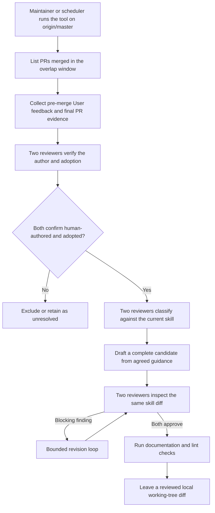

# Agent Note: Bảo trì định kỳ do con người thực hiện cho `dsh-code-review`

Status: proposed

[English](2026-07-13-human-review-skill-maintenance.md) | Tiếng Việt

## Vấn đề

Skill (kỹ năng) `dsh-code-review` ghi lại các mẫu thất bại cần đến phán đoán của người review, nhưng việc tổ chức audit một lần rồi lặp lại tốn kém, và phạm vi cũng dễ trở nên không nhất quán. Nếu coi mỗi bình luận là một bài học thì checklist sẽ phình to không ngừng; còn nếu coi việc merge, thread thảo luận đã resolve, hoặc tác giả trả lời "đã sửa" là bằng chứng được tiếp thu, thì sẽ nâng phản hồi — vốn có thể chưa thực sự được đưa vào code cuối cùng — lên thành quy tắc. Quy trình bảo trì cần đủ bằng chứng và có review độc lập, để khi bằng chứng không đủ thì xử lý theo hướng không tiếp thu, đồng thời không cần đưa vào dịch vụ webhook, trạng thái sự kiện bền vững, hay cơ chế đề xuất (promotion) tự động lên repo trước khi quy trình chứng minh được giá trị thực tế.

## Đề xuất

Bảo trì định kỳ bên ngoài repo. Một công cụ riêng tư, lưu trên máy của người bảo trì skill và không commit vào repo này, sẽ chạy trên một checkout lịch sử đầy đủ, sạch, đã refresh về `origin/master`. Bộ lập lịch dự kiến chạy hằng ngày, sử dụng cửa sổ chồng lấn (overlap window) UTC hai ngày; khi chạy thủ công có thể chỉ định một khoảng `--since` khác hoặc một tập hợp tường minh bằng các tham số `--pr` lặp lại. Việc quét là idempotent so với skill hiện tại, không lưu con trỏ (cursor) của repo. Tệp repo duy nhất bị thay đổi khi đề xuất (promotion) là [.agents/skills/dsh-code-review/SKILL.md](../../../skills/dsh-code-review/SKILL.md); PR (Pull Request) ở dạng draft liệt kê URL hoặc ID phản hồi nguồn và bằng chứng tiếp thu, không công khai log của adapter riêng tư.

### Quy ước thu thập

Mỗi PR được chọn đều bị lọc trước khi thu thập bất kỳ phản hồi nào: merge commit của nó phải là tổ tiên (ancestor) của `origin/master`. Khả năng truy cập được của merge commit là điều kiện đủ tư cách duy nhất: các PR xếp chồng (stacked) có base trực tiếp là một nhánh tính năng vẫn được đưa vào, miễn là base đó sau này đã vào master, vì bất kể stack trung gian ra sao, đoạn code mà người review bình luận lúc này đã nằm trên master. Công cụ cũng phân giải cha (parent) đích của merge khi landing; những hình thái landing không thể tái dựng được sẽ ghi vào `skipped-pulls.json` và bị bỏ qua. Một PR đơn lẻ thất bại ở bước tiền kiểm tra, thu thập, hoặc thu thập bằng chứng sẽ chỉ bị bỏ qua, không làm dừng cả lần chạy. Nếu khoảng thời gian vượt quá giới hạn 1.000 kết quả của GitHub Search, giai đoạn tìm kiếm sẽ báo lỗi rõ ràng, để tránh bỏ sót PR đã merge mà không có cảnh báo. Giai đoạn thu thập đọc đầy đủ các liên kết phân trang của bình luận review nội tuyến, các review commit, và commit của PR. Không thu thập bình luận thảo luận (conversation comment) của PR, vì sau khi force-push, trạng thái hiện tại của GitHub không thể chứng minh commit nào còn tồn tại nằm trước bình luận đó, nên quy ước tiếp thu tất yếu phải loại trừ vô điều kiện các bình luận này. Workflow chỉ chấp nhận phản hồi đã thu thập khi GitHub báo cáo `type` của actor là `User`, và cả thời điểm tạo lẫn thời điểm chỉnh sửa cuối đều nghiêm ngặt sớm hơn thời điểm merge của PR; chỉnh sửa cùng mốc thời gian với merge được coi là thao tác sau merge. Review commit dùng `lastEditedAt` của GraphQL, vì biểu diễn REST không chứa thời gian chỉnh sửa.

### Bằng chứng tiếp thu

Mỗi phản hồi mang một ID nguồn ổn định và bằng chứng thay đổi có giới hạn. Khi `commit_id` của người review vẫn thuộc về PR đó (trường hợp force-push không thể xác nhận sẽ bị loại), công cụ chọn commit PR mới nhất mà timestamp của committer nghiêm ngặt sớm hơn phản hồi làm baseline, thay vì dùng commit mà người review đã click, vì commit đó có thể cũ hơn. Công cụ không bao giờ so sánh trực tiếp baseline này với merge khi landing: diff kiểu đó sẽ lẫn cả những thay đổi không liên quan trên nhánh đích luôn di chuyển về phía trước. Thay vào đó, nó cung cấp cho người review tiếp thu hai bản snapshot patch dành riêng cho PR. Gọi `B` là baseline phản hồi, `T` là cha đích của merge khi landing, `M` là merge khi landing. Snapshot tại thời điểm phản hồi là tree diff từ `merge-base(B, T)` đến `B`; snapshot cuối cùng là tree diff từ `T` đến `M`. Do đó, các thay đổi riêng của nhánh đích sẽ không xuất hiện trong bất kỳ patch PR nào, còn các thay đổi được thêm vào PR sau khi có phản hồi chỉ xuất hiện trong snapshot cuối cùng. Các review có commit liên quan không còn thuộc về PR đó do force-push, phản hồi sớm hơn tất cả các commit PR hiện có, và các hình thái landing không thể tái dựng cha đích, đều được phân loại tất định là `unclear` trước khi bất kỳ người review nào nhìn thấy. Trạng thái merge, thread thảo luận đã resolve, tác giả trả lời "đã sửa", hoặc chỉnh sửa cùng tệp chỉ là ngữ cảnh, không phải bằng chứng tiếp thu; bình luận của chính tác giả PR không bao giờ được đưa vào adapter, vì chúng không thể coi là sự tiếp thu ý kiến của chính tác giả.

### Phân loại và soạn thảo bởi hai người review độc lập

Hai adapter review được cấu hình độc lập sẽ phân loại từng mục đủ điều kiện: ai đã viết nó (`human-authored`, `forwarded-automation`, hoặc `unclear`), và liệu thay đổi có tiếp thu nó hay không (`adopted`, `rejected`, hoặc `unclear`). Chỉ những mục mà cả hai adapter đều xác định là `human-authored` cộng `adopted` mới được tiếp tục. Tập hợp đã tiếp thu sau đó trải qua lần phân loại độc lập thứ hai đối chiếu với skill hiện tại: ứng viên, đã được bao phủ, đặc thù cho một triển khai cụ thể, hoặc không phải phản hồi. Một mục đơn lẻ là đủ điều kiện, không yêu cầu xuất hiện lặp lại. Bất đồng quan điểm sẽ được đánh giá lại một lần có giới hạn; nếu vẫn chưa giải quyết được, mục đó tiếp tục được giữ lại trong sản phẩm của lần chạy. Nếu đầu ra của adapter cho một batch đơn lẻ không qua kiểm tra schema hoặc kiểm tra id, hệ thống sẽ xử lý theo hướng không tiếp thu ở cấp batch: mọi phản hồi trong đó đều được đánh dấu unclear và định tuyến vào `excluded`, thay vì làm dừng cả lần chạy; đầu ra thô có vấn đề sẽ được lưu trong sản phẩm riêng tư của lần chạy đó để phục vụ debug. Nếu bất kỳ adapter nào không trả về kết quả hợp lệ cho bất kỳ batch không rỗng nào trong một thao tác, lần chạy sẽ thoát với trạng thái khác 0 và phát ra bản ghi lỗi, thay vì báo cáo "không có ứng viên".

Adapter chính chỉ soạn thảo dựa trên hướng dẫn chung đã được cấu trúc hóa, không bao giờ nhận văn bản review thô. Theo quy ước của tác giả adapter, nó không có tool và chỉ đọc: trả về nội dung ứng viên đầy đủ của tệp, để công cụ kiểm tra rồi ghi vào đích duy nhất. Sau đó, cả hai adapter cùng review chung một diff skill hoàn chỉnh; vấn đề mang tính chặn (blocking) sẽ đi vào một vòng chỉnh sửa có giới hạn, và cả hai phải phê duyệt cùng một phiên bản chỉnh sửa. Công cụ sẽ từ chối lại các thay đổi đang staged và các chỉnh sửa nằm ngoài skill đích trước khi chạy kiểm tra tài liệu và lint, cũng như trước khi báo cáo thành công, để không có tiến trình kiểm tra hay tiến trình chạy song song nào có thể trộn thêm đường dẫn khác vào. Khi thất bại, công cụ dùng phép so sánh và hoán đổi (compare-and-swap) theo kiểu cố gắng tối đa và hoàn tác các ghi của chính nó, để không ghi đè lên các chỉnh sửa song song của người bảo trì. Khi thành công, nó lưu một gói tư liệu ứng viên gồm: commit nguồn `origin/master`, blob ID của skill nguồn, diff đã review, tệp ứng viên đầy đủ, ID và URL phản hồi nguồn, phạm vi bằng chứng landing, phán quyết của adapter và kết quả kiểm tra; nó không bao giờ commit, push, mở hay merge PR.

### Giao thức của adapter review

Mỗi tệp thực thi riêng tư nhận từ stdin một request JSON có giới hạn byte, có phiên bản, và trả về trên stdout một JSON có giới hạn byte, tuân theo schema. Khi hai lệnh review phân giải ra cùng một tệp thực thi giống hệt nhau từng byte, công cụ từ chối chạy; đây chỉ là một kiểm tra máy móc tối thiểu; việc bảo đảm adapter chính và adapter phụ được vận hành bởi nhà cung cấp hoặc mô hình độc lập vẫn là trách nhiệm của bên vận hành khi triển khai. Các trường `access` và `tools` là các nhãn quy ước mà tác giả adapter chịu trách nhiệm, không phải sandbox của hệ điều hành: tiến trình con review được spawn trong một môi trường đã dọn sạch, `cwd` của nó trỏ tới thư mục chạy riêng tư, không phải gốc repo; phản hồi được bọc trong khối `<untrusted-feedback nonce="…">` có số ngẫu nhiên (nonce), và mỗi prompt đều yêu cầu mô hình coi đó là dữ liệu; nonce 128-bit ngăn phần thân không đáng tin cậy giả mạo thẻ đóng. Mỗi tiến trình con đều áp dụng cơ chế dọn dẹp cây tiến trình có giới hạn, nhận biết hủy bỏ (abort-aware). Tác giả adapter triển khai mỗi thao tác như một suy luận (inference) thuần túy, chỉ đọc; ngay cả thao tác `edit` cũng chỉ trả về nội dung ứng viên đầy đủ trong JSON, để công cụ kiểm tra rồi ghi vào đích duy nhất. Mỗi lệnh `git`/`gh`/kiểm tra ở môi trường production cũng được spawn trong một môi trường đã dọn sạch, để tránh các biến định tuyến của pre-push hook chuyển hướng công cụ bảo trì mà không có cảnh báo. Việc ghi ứng viên và hoàn tác khi thất bại dùng phép so sánh và hoán đổi theo kiểu cố gắng tối đa dựa trên nội dung ghi gần nhất; việc hoàn tác cũng hủy staging đích, để tránh ứng viên do adapter hoặc kiểm tra staging còn sót lại sau một lần chạy thất bại và lọt vào commit sau đó.

### Quy ước đề xuất (promotion)

Công cụ trợ giúp đề xuất bắt đầu từ một checkout sạch đã refresh về `origin/master`; khi blob skill hiện tại khác với blob nguồn được ghi trong gói tư liệu, nó sẽ từ chối áp dụng ứng viên. Khi đó, bên vận hành sẽ chạy lại phân tích bảo trì, hoặc rebase diff thủ công rồi review lại ứng viên; công cụ trợ giúp không bao giờ thay thế `SKILL.md` mới hơn bằng đầu ra tệp đầy đủ đã lỗi thời. Sau khi áp dụng ứng viên vẫn còn hợp lệ, nó sẽ mở một PR draft, với nội dung liệt kê URL hoặc ID phản hồi nguồn, phạm vi commit landing dùng làm bằng chứng tiếp thu, lần chạy đã khởi tạo ứng viên đó, kết quả kiểm tra, và bất kỳ chỉnh sửa nào của bên vận hành. Prompt và phản hồi gốc của adapter vẫn giữ ở chế độ riêng tư, nhưng người review trong repo sẽ nhận được các đầu vào cụ thể này, nhờ đó có thể phán đoán liệu mỗi quy tắc được đề xuất có thực sự đến từ phản hồi con người đã được tiếp thu hay không.

### Cơ chế nằm ở đâu

Mã nguồn công cụ, tệp thực thi của adapter, thông tin xác thực nhà cung cấp, và bộ lập lịch hằng ngày dự kiến đều được lưu trên máy của người bảo trì, không commit vào repo này. Tài liệu này quy định giao thức, còn cách triển khai tham khảo thuộc về hạ tầng riêng tư. Cơ chế này chỉ phục vụ một skill do một bên vận hành duy nhất bảo trì, do đó, chi phí liên tục thay đổi qua cơ chế review repo sẽ vượt quá lợi ích của việc commit công cụ cùng lịch sử của nó. Nếu cơ chế này trong tương lai được bàn giao cho người bảo trì thứ hai, việc bàn giao cần một Agent Note kế tiếp để sửa đổi quyết định này; bất kỳ ai tiếp nhận nên bắt đầu từ tài liệu vận hành [docs/cookbook/maintaining-dsh-code-review.md](../../../../docs/cookbook/maintaining-dsh-code-review.md).

## Các phương án thay thế đã cân nhắc

- **Đưa công cụ vào repo này.** Không được chấp nhận đối với phạm vi một người bảo trì duy nhất: chi phí bảo trì repo (kiểm tra kiểu, lint, độ phủ và tái cấu trúc xuyên suốt) sẽ vượt quá giá trị của việc commit mã nguồn và lịch sử review. Có thể cân nhắc lại khi bàn giao trong tương lai.
- **Ghi lại head của PR tại thời điểm mỗi phản hồi phát sinh**: không được chấp nhận, vì điều này đòi hỏi một trình quan sát chạy liên tục, trạng thái sự kiện bền vững, cơ chế retry và phối hợp force-push. Bảo trì định kỳ sẽ dùng bằng chứng commit đã review khi có sẵn, và loại trừ thẳng khi phạm vi bằng chứng của toàn PR quá rộng, không thể xác nhận được.
- **Lưu bền vững con trỏ PR đã xử lý**: không được chấp nhận, vì việc quét theo cửa sổ thời gian có chồng lấn có chi phí thấp và tự nhiên là idempotent so với skill hiện tại; trạng thái con trỏ ngược lại gây ra vấn đề khôi phục và bỏ sót sự kiện.
- **Chạy mỗi khi có bình luận mới**: không được chấp nhận, vì một vòng review sinh ra nhiều bình luận liên quan, và thiếu sản phẩm cuối cùng cần thiết để phán đoán mức độ tiếp thu.
- **Coi việc merge hoặc resolve thread là tiếp thu**: không được chấp nhận, vì PR có thể được merge trong khi phản hồi đã bị từ chối, bị thay thế, hoặc cố ý không giải quyết.
- **Tự động tạo hoặc merge thay đổi vào repo**: không được chấp nhận, vì công cụ trước hết cần tích lũy được uy tín thông qua đầu ra định kỳ có ích. Người bảo trì kiểm tra và đề xuất diff cục bộ thông qua review repo thông thường.
- **Học từ các vấn đề bot đã tự sửa**: không được chấp nhận, vì quy ước nguồn giới hạn ở phản hồi review của con người. Hệ thống lọc theo loại tác giả trước khi phân tích, và loại trừ các tài khoản con người chuyển tiếp vấn đề tự động hóa thông qua kiểm tra tác giả.
- **Để cùng một người review vừa làm tác giả vừa đưa ra phán quyết cuối cùng**: không được chấp nhận, vì phán quyết độc lập giúp phát hiện vấn đề trước khi một khái quát hóa không được hỗ trợ đầy đủ lọt vào skill.

## Tiêu chí nghiệm thu

Để đề xuất từ `proposed/` lên `implemented/`, cần quan sát được toàn bộ các sự thật sau trong một lần chạy end-to-end thực tế nhắm vào repo này:

- Công cụ riêng tư chạy từ một checkout detached sạch đã refresh về `origin/master`, và hoặc báo cáo "không có ứng viên", hoặc chỉ sinh ra một diff working-tree cho `.agents/skills/dsh-code-review/SKILL.md`. **Đã quan sát ngày 2026-07-15:** quét 62 PR đã merge, bỏ qua 5 (merge commit không thể truy cập hoặc thu thập vượt giới hạn 250 commit), xem xét 426 phản hồi của con người, phát hiện 0 ứng viên.
- Hai adapter review được cấu hình độc lập (nhà cung cấp hoặc mô hình khác nhau) hoàn tất quy trình analyze/adopt/review mà không cần can thiệp của người dùng. **Đã quan sát ngày 2026-07-15:** adapter chính/phụ khác nhau mất khoảng 8 phút để hoàn tất bước tiếp thu và phân tích; một lần adapter "ảo giác" id được xử lý bằng cơ chế thất bại thận trọng ở cấp batch, không làm dừng cả lần chạy.
- Bộ lập lịch kích hoạt công cụ mà không cần terminal tương tác, và gửi diff ứng viên (hoặc bản ghi "không có ứng viên") tới bên vận hành qua một kênh thông báo bền vững.
- Một kịch bản thu thập có kiểm soát sẽ thêm vào nhánh đích một thay đổi khớp với phản hồi, sau baseline phản hồi; bằng chứng review loại trừ thay đổi riêng của nhánh đích đó, đồng thời vẫn giữ lại các thay đổi được PR tự thêm vào sau đó.
- Sau khi skill nguồn thay đổi, công cụ trợ giúp đề xuất sẽ từ chối ứng viên; ứng viên vẫn còn hợp lệ sẽ mở một PR draft chứa ID phản hồi nguồn, phạm vi commit đã tiếp thu, lần chạy đã khởi tạo ứng viên đó, kết quả kiểm tra và chỉnh sửa của bên vận hành như đã định nghĩa ở trên.
- Ít nhất một diff ứng viên do workflow này sinh ra sẽ được bên vận hành kiểm tra và đề xuất lên `master` thông qua review PR repo thông thường. PR đó dùng để chứng minh workflow có thể chuyển hóa phản hồi đã tiếp thu thành hướng dẫn skill đã được bàn giao.

## Rủi ro

- **Suy luận quan hệ nhân quả dựa trên timestamp của committer.** Baseline commit của phản hồi được chọn bằng cách so sánh timestamp commit của GitHub với timestamp tạo phản hồi; độ lệch đồng hồ (clock skew) của committer và việc viết lại lịch sử vẫn để lại một khoảng cửa sổ sai sót còn sót lại khi đánh giá tiếp thu. Đối chiếu chéo với luồng sự kiện PR của GitHub có thể siết chặt hơn nữa, nhưng đòi hỏi thu thập vượt ra ngoài phạm vi của công cụ định kỳ.
- **Hai kết quả phân loại "không phải ứng viên" được định tuyến thẳng vào `excluded`, không đi vào vòng tranh chấp.** Cả hai bộ phân loại đều phán quyết "không phải ứng viên", nhưng khi bất đồng về lý do không phải ứng viên (ví dụ `covered` so với `specific`), mục đó sẽ bị loại trừ thay vì được đánh giá lại. Cả hai bộ phân loại đều đồng ý rằng nó sẽ không hình thành hành vi review mới, nên vòng tranh chấp sẽ không thay đổi kết quả.
- **Tính độc lập của hai người review, vượt ra ngoài phạm vi so sánh hash byte, là một quy ước triển khai.** Khi hai lệnh phân giải ra tệp thực thi giống hệt nhau từng byte, công cụ từ chối chạy, nhưng nó không thể xác minh liệu hai lớp bọc khác nhau có thực sự được vận hành bởi nhà cung cấp hoặc mô hình khác nhau hay không. Bên vận hành phải tự cấu hình adapter chính và adapter phụ độc lập với nhau.
- **Việc ghi và hoàn tác ứng viên dùng phép so sánh và hoán đổi kiểu cố gắng tối đa.** Phép so sánh và hoán đổi dựa trên tệp trên POSIX không thực sự atomic; cửa sổ rủi ro kéo dài trong một chu kỳ vòng lặp sự kiện. Công cụ này hướng tới bảo trì định kỳ một người dùng, không tính đến các trình soạn thảo chỉnh sửa đồng thời thực sự.
- **Rủi ro một người bảo trì duy nhất.** Vì cơ chế nằm trên một máy duy nhất, việc bảo trì skill sẽ hoàn toàn dừng lại sau khi dịch vụ gián đoạn, cho đến khi bên vận hành khôi phục dịch vụ, hoặc bàn giao cơ chế cho người bảo trì mới thông qua một Agent Note kế tiếp.
