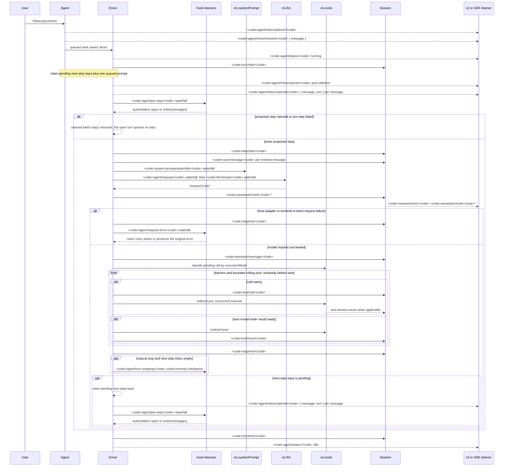

<!-- Tệp nguồn tiếng Anh do scripts/gen-doc-graphs.ts sinh ra; tệp tiếng Việt này là bản đối chiếu đã được rà soát, duy trì qua ghép cặp song ngữ.
     Khi cập nhật, trước tiên chạy `pnpm run gen-doc-graphs` để cập nhật bản tiếng Anh, sau đó cập nhật tệp này rồi chạy `pnpm run verify-translation-pairing --write docs/agent-lifecycle.md` để ghi lại cặp ghép. -->

# Vòng đời lượt (turn) và bước (step) của Agent

[English](agent-lifecycle.md) | Tiếng Việt

Sơ đồ trình tự này đi kèm với [architecture.md](architecture.md#turn-flow). Các sự thật replay bền vững được lưu trong `session/event`, còn điều khiển và trạng thái thời gian thực được lưu trong `agent/*`.

Sự kiện `assistant/message` ghi lại mỗi lượt gọi thành công tới provider, bao gồm cả lượt gọi trả về nội dung rỗng hoặc kết thúc bằng `max-tokens`. Nội dung rỗng sẽ không đi vào lịch sử dẫn xuất, nhưng sự kiện bền vững đó vẫn giữ lại thông tin sử dụng (usage), và liệt kê chính xác các sự kiện `assistant/chunk` tương ứng qua `sourceEventSeqs`, kể cả khi đó là một danh sách rỗng tường minh.

`dsh-compaction-basic` xử lý áp lực trước khi dẫn xuất request thông qua `agent/pre-step`, còn `agent/request-error` chỉ dùng cho trường hợp tràn ngữ cảnh (context overflow) chuẩn. Sau khi bất kỳ điều kiện kích hoạt nào được thỏa mãn, hệ thống sẽ thực hiện bước cắt tỉa (pruning) kết quả công cụ tùy chọn trước, rồi mới chọn tóm tắt. Việc khôi phục diễn ra sau khi bước thất bại kết thúc, trước khi lượt thất bại kết thúc; chỉ khi việc cắt tỉa hoặc sinh tóm tắt đã thúc đẩy surface replacement generation, hệ thống mới mở một lượt retry hoàn toàn mới, nếu không vẫn giữ nguyên lỗi request ban đầu.

Quyết định `agent/pre-step` được trả về là quyết định có hiệu lực cuối cùng; listener bọc `next()` sẽ giữ lại các message xuôi dòng, trừ khi cố ý thay thế các message đó. Steering (điều hướng giữa chừng) và ngữ cảnh được tiêm vào sẽ đi qua cùng một waterfall (chuỗi sự kiện dạng thác nước) này, sau khi thao tác claim tiếp theo lấy được batch bước kế tiếp của nó.

Người dùng SDK cần dữ liệu transcript (bản ghi) có thể replay nên tiêu thụ `session/event`; `agent/*` là giao diện phối hợp thời gian thực dùng cho hàng đợi và trạng thái, chặn prompt, dựng request, steering, tiếp tục thực thi, và xử lý lỗi.

Chế độ bảo trì: tệp nguồn tiếng Anh chứa sơ đồ trình tự Mermaid được duy trì thủ công và do bộ sinh ghi ra; tệp tiếng Việt này là bản đối chiếu đã được rà soát, duy trì qua ghép cặp song ngữ. Chữ ký sự kiện chính xác nằm trong danh mục Cordis được sinh ra.
