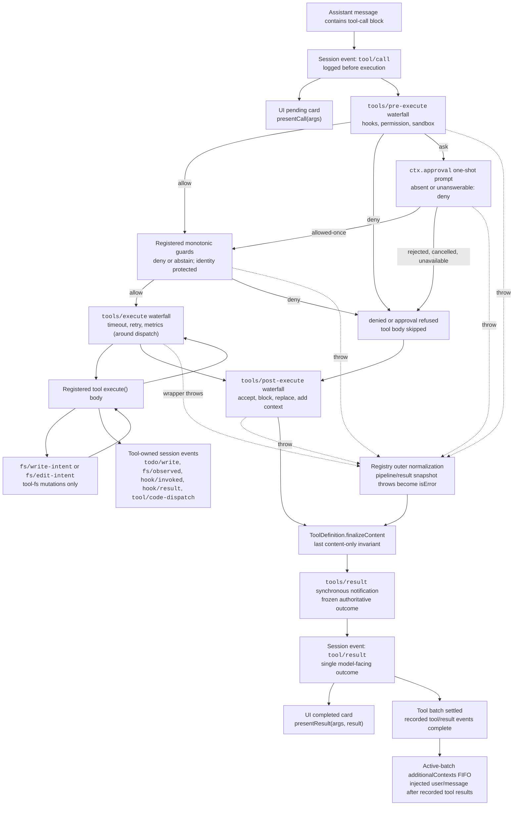

<!-- Tệp nguồn tiếng Anh được sinh bởi scripts/gen-doc-graphs.ts; tệp tiếng Việt này là bản đối chiếu đã được thẩm định, duy trì qua cơ chế ghép cặp song ngữ.
     Khi cập nhật, hãy chạy `pnpm run gen-doc-graphs` để cập nhật bản tiếng Anh trước, rồi cập nhật tệp này và chạy `pnpm run verify-translation-pairing --write docs/tool-execution-pipeline.md` để ghi lại cặp ghép. -->

# Pipeline thực thi công cụ

[English](tool-execution-pipeline.md) | Tiếng Việt

Sơ đồ này cho thấy chính sách, hook, sandbox, guard hệ thống tệp, việc ghi lại kết quả, quan sát kết quả cuối cùng và kết xuất UI chạy vào lúc nào mà không làm thay đổi vòng lặp. Waterfall (sự kiện thác nước) `tools/pre-execute` chạy trước, tiếp đến là các guard đơn điệu, rồi tới waterfall `tools/execute` và `tools/post-execute`; ba waterfall này có thể viết lại một lời gọi. `finalizeContent` do chính định nghĩa kiểm soát và `tools/result` chạy sau đó.

Kiểm tra đọc-trước-khi-sửa của hệ thống tệp nằm dưới `tool-fs`, hiện thực qua các sự kiện `fs/*`. Waterfall tiền／hậu xử lý dùng chung mang theo hook và chính sách phê duyệt; `ctx.approval` xử lý việc hỏi trước các guard đơn điệu, còn những chính sách của chủ sở hữu không được phép sắp xếp lại thứ tự thì vẫn ở dạng guard đã đăng ký. Các mối quan tâm bao quanh việc điều phối như timeout thì bọc quanh `tools/execute`. Registry sẽ chụp ảnh kết quả ứng viên mà không mất mát; nếu việc chụp ảnh thất bại thì lỗi được chuẩn hóa trước, sau đó callback `finalizeContent` — vốn đã được cố định cùng ảnh chụp trong định nghĩa hiển thị — sẽ ép buộc bất biến đồng bộ chỉ liên quan tới nội dung của nó. Kế đó, `tools/result` quan sát kết quả bất biến, biểu diễn được bằng JSON mà không mất mát. Nhờ vậy, hook có thể trải rộng qua các họ công cụ khác nhau mà không buộc công cụ phải gắn chặt với một dịch vụ chính sách nào. Code Mode đưa cả kênh truyền `run_code` được dành riêng lẫn các lời gọi con đã tuần tự hóa của nó vào pipeline; lời gọi con mang token của cấp cha, ghi lại `tool/code-dispatch`, trình bày việc từ chối như một sự bác bỏ có tính ràng buộc, và bỏ qua `additionalContexts` để giữ lời gọi nằm kề kết quả.

Chế độ bảo trì: tệp nguồn tiếng Anh chứa sơ đồ luồng Mermaid do người duy trì thủ công và được bộ sinh ghi ra; tệp tiếng Việt này là bản đối chiếu đã thẩm định, duy trì qua cơ chế ghép cặp song ngữ. Schema công cụ và chữ ký sự kiện chính xác nằm trong danh mục được sinh ra.
